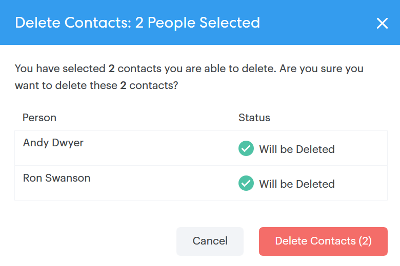

# 对人员执行批量操作 {#bulk-actions-on-people}

为了节省时间，您可以对联系人批量执行一些操作。

所有可用批量操作的第一步是选择两个或多个联系人，然后单击圆点（三个垂直点）。

## 将人员添加到组 {#add-people-to-group}

将多个人员同时添加到组。

## 源 {#source}

我们自动为进入数据库的每个联系人分配一个源。 使用此步骤可更新该源。

>[!NOTE]
>
>源不可自定义。

## 授权 {#authorization}

符合 [GDPR](https://eugdpr.org/)，使用授权来指示您是如何获得与这些联系人进行交互的权限的。

## 取消订阅 {#unsubscribe}

对不再希望收到您信函的联系人执行批量取消订阅。

## 删除 {#delete}

批量删除联系人。 可以找到完整步骤 [此处](/help/marketo/product-docs/marketo-sales-connect/people/managing-contacts/creating-and-deleting-contacts.md).

