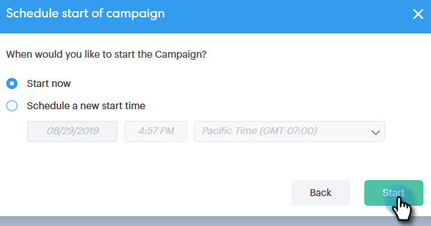

# 与组{#connecting-with-a-group}连接

了解如何向整个组发送电子邮件，或向活动添加组。

## 组操作：电子邮件{#group-action-email}

1. 选择要通过电子邮件发送的组。

   

1. 单击&#x200B;**“组操作**”按钮并选择&#x200B;**“电子邮件组**”。

   

1. 填写您的电子邮件和计划/发送。

   

   就这样。 该组中的每个人都将收到该电子邮件。

## 组操作：添加到销售活动{#group-action-add-to-sales-campaign}

1. 选择要添加到活动的组。

   

1. 单击&#x200B;**“组操作**”按钮，然后选择“将组添加到活动&#x200B;**”。**

   

1. 确认已选择正确的人员，然后单击&#x200B;**下一步**。

   

   >[!NOTE]
   >
   >您可能会看到添加到Marketo活动的选项。 [那是另一篇文章](/help/marketo/product-docs/marketo-sales-connect/campaigns/add-to-marketing-campaign.md)。

1. 选择活动(可以选择类别以缩小结果范围)，然后单击&#x200B;**下一步**。

   

1. 进行任何所需的编辑，然后单击&#x200B;**下一步**。

   

1. 计划活动并单击&#x200B;**开始**。

   
