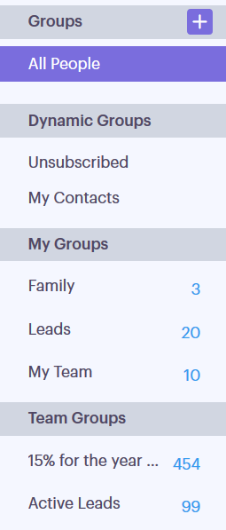

# 组类型 {#group-types}

了解Sales Connect中的不同组类型。

<table> 
 <colgroup> 
  <col> 
  <col> 
 </colgroup> 
 <tbody> 
  <tr> 
   <th>组</th> 
   <th>描述</th> 
  </tr> 
  <tr> 
   <td>
所有人员
</td> 
   <td>您可见的所有用户的所有联系人。</td> 
  </tr> 
  <tr> 
   <td colspan="1">
动态组
</td> 
   <td colspan="1">我的联系人：您拥有的所有联系人。 取消订阅：已选择退出接收通信的联系人。</td> 
  </tr> 
  <tr> 
   <td>
我的组
</td> 
   <td>您创建的组。 它们可以包含您的联系人或已与您共享的联系人。</td> 
  </tr> 
  <tr> 
   <td>
团队组
</td> 
   <td>已与您和/或由您共享的组。 它们可以包含您的队友拥有的联系人或您与其共享的联系人。</td> 
  </tr> 
 </tbody> 
</table>
