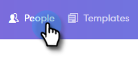
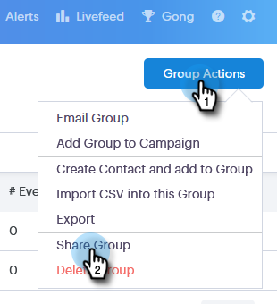

# 如何共享组{#how-to-share-a-group}

在Sales Connect中，与团队共享一组潜在客户或联系人非常简单。

1. 转到&#x200B;**People**&#x200B;选项卡。

   

1. 选择要共享的组。

   

1. 单击** “组操作”**按钮并选择&#x200B;**“共享组”**。

   

1. 选择要与之共享的子团队，并为您的团队添加备注。

   

1. 单击&#x200B;**共享**。

   

