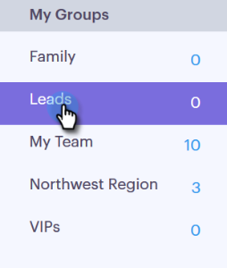

# 通过CSV {#import-contacts-via-csv}导入联系人

在“人物”页面中拥有联系人非常重要，因为我们可以从那里获取信息，并在模板的动态字段中自动填写个性化信息。 请确保您在CSV中至少拥有每个联系人的姓名和电子邮件地址，并且已映射到这些字段。

1. 在“人员”选项卡中选择您的用户组（或创建新用户组）。

   

1. 单击&#x200B;**“分组操作**”，然后选择“导入CSV **”。**

   

1. 单击&#x200B;**浏览**。

   

1. 在计算机上找到文件并将其选中。

   >[!NOTE]
   >
   >群组限制为1000个联系人。

1. 单击&#x200B;**下一步**。

   

1. 将CSV中的列映射到Sales Connect中各自的字段。 完成后，单击&#x200B;**下一步**。

   
