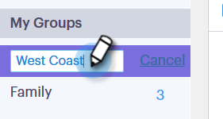

# 管理组 {#manage-groups}

了解如何在Sales Connect中管理您的组。

## 创建组 {#create-a-group}

1. 在“人员”页面中，单击 **+** “组”旁边。

   

1. 命名您的群组并单击 **创建**.

   

   就是这样！

## 将联系人添加到组 {#add-contacts-to-a-group}

1. 在“人员”页面中，查找并选择要将人员添加到的组。

   

1. 单击 **组操作** 并选择 **创建联系人**.

   

   >[!NOTE]
   >
   >这将一次添加一个联系人。 要同时添加多个联系人，请按照 [这些步骤](/help/marketo/product-docs/marketo-sales-connect/people/managing-contacts/import-contacts-via-csv.md).

1. 填写联系人信息并单击 **创建** (或 **创建和新增** 以添加另一个)。

   

   你完蛋了！

   >[!NOTE]
   >
   >您可能必须点击“刷新”才能看到添加的任何新联系人。

## 共享组 {#share-a-group}

1. 在“人员”页面中，查找并选择要共享的组。

   

1. 单击圆点（三个垂直的点）并选择 **共享**.

   

1. 单击下拉列表，然后选择要与其共享组的团队。

   

1. 单击 **共享**.

   

   您仍拥有该组，但它现在将显示在“团队组”下。

## 取消共享组 {#unshare-a-group}

1. 在“人员”页面中，查找并选择要取消共享的组。

   

1. 单击圆点（三个垂直的点）并选择 **共享**.

   

1. 单击 **X** 在与您共享该组的团队旁边，然后单击退出该模式。

   

   该组现已取消共享。

## 重命名组 {#rename-a-group}

1. 在“人员”页面中，查找并选择要重命名的组。

   

1. 单击圆点（三个垂直的点）并选择 **重命名**.

   

1. 键入新名称并按Enter。

   

## 删除组 {#delete-a-group}

1. 在“人员”页中，查找并选择要删除的组。

   

1. 单击圆点（三个垂直的点）并选择 **删除**.

   

1. 单击 **删除** 以确认。

   
