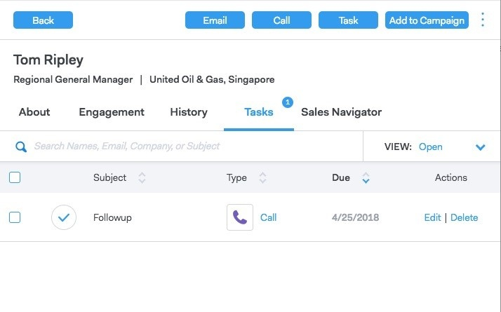

# 人员详细信息视图{#person-detail-view}

人员详细视图提供MSC帐户中每个人的详细用户档案。

## 如何访问{#how-to-access}

1. 要访问人员详细信息视图卡，请单击&#x200B;**人员**&#x200B;选项卡。

   

1. 单击所需人物。

   

   >[!TIP]
   >
   >几乎在您看到某人姓名的任何地方，都可以单击该姓名并转到其“人员详细信息”视图。

## 关于Tab {#about-tab}

包括该人员的所有联系信息。

**联系卡**

* 包含以下联系信息：电子邮件地址、姓名、公司、标题、电话号码和社交媒体链接

**组**

* 显示并管理此人是其成员的组

**帐户信息**

* 可以将人员添加到Salesforce
* 从Salesforce提取帐户和潜在客户／联系信息

**自定义字段**

* 添加或删除可用作模板和活动中动态字段的自定义字段

**注释**

* 创建自定义备注

## “参与”选项卡{#engagement-tab}

了解此人如何与您的外展互动。

**销售连接活动**

* 查看销售电子邮件和活动中的参与活动

**营销活动**

* 了解您的人如何与营销活动互动

## 历史记录选项卡{#history-tab}

显示您的推广历史。 包括电子邮件、活动和电话。

**销售活动**

* 查看此人所属的任何有效或已完成活动

**营销活动**

* 查看此人是其成员的任何营销活动

**销售电子邮件**

* 查看您发送给此人的任何电子邮件以及互动指标

**销售电话**

* 查看您给此人打的任何电话

## 任务选项卡{#tasks-tab}

管理与此人关联的任务。

您可以执行的操作：

* 编辑或删除任务
* 查看截止日期
* 单击“类型”以启动销售电话（如果呼叫）、“电子邮件时起草”、“电子邮件时链接”（如果收件）和“自定义备注”（如果自定义）。
* 将任务标记为完成

## 销售导航器选项卡{#sales-navigator-tab}

视图LinkedIn用户档案数据与LinkedIn的销售导航器。

>[!NOTE]
>
>Sales Navigator是通过LinkedIn付费的附加组件，请与他们联系以获取此功能。

提到破冰船来建立联系。

在销售导航器中将联系人另存为潜在客户。
