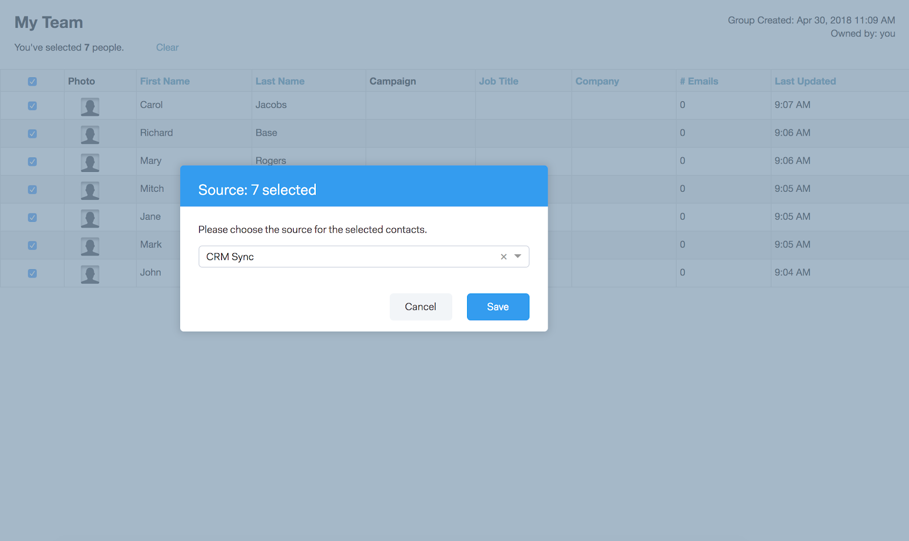

# Sales Connect和GDPR合规性 {#sales-connect-and-gdpr-compliance}

《通用数据保护条例》(GDPR)是欧盟法律，已于2018年5月25日生效。

## 概述 {#overview}

其目的是加强欧洲联盟（欧盟）和欧洲经济区（欧经区）内数据主体对其个人数据使用和保护方式的权利。 “个人数据”是指与已识别或可识别的自然人相关的任何信息。

GDPR围绕六项关键原则制定（详见法律第5条）：

1. 数据的使用方式及其用途的透明度。
1. 确保收集的数据仅用于收集时明确指定的目的。
1. 将数据收集限制为满足收集目的所必需的。
1. 确保数据准确。
1. 仅将数据存储所需的时间，以达到预期目的。
1. 通过部署适当的安全措施，防止未经授权使用或意外丢失数据。

此外，还提出了新的问责要求，以便能够演示如何管理和跟踪法规遵从性。 这意味着要维护有关如何及为什么收集个人数据的记录，以及保护个人数据的过程的文档。

## 它适用于谁？ {#to-whom-does-it-apply}

GDPR适用于欧盟内外向欧盟和EEA内的数据主体营销商品或服务以及/或跟踪其行为的任何组织。 如果您与欧洲的数据主体开展业务往来，其中涉及对个人数据的处理，则此法规适用于您。 违规行为将受到严厉处罚，违规者要面临巨额罚款；单次违规的最高罚款额为2,000万欧元，相当于全球年营业额的4%，以金额较大者为准。

## 对营销的影响 {#implications-for-marketing}

营销人员旨在打造一种人情味十足的客户体验，这种体验建立在信任的基础上，并谨慎地提供。 虽然GDPR未使用这些术语，但其目标相同 — 尊重客户的权利并赢得他们的信任。 要建立并维持这种信任，营销人员必须了解客户希望参与的方式、时间和原因。 尊重客户的喜好至关重要，不仅将其作为法律要求，而且作为以客户为中心的接洽实践的基础。

营销人员如何解决其工作过程中经常使用的个人数据的收集、使用和安全方面的这些更高期望至关重要，Marketo可以帮助满足这些期望。

GDPR有两个关键方面，营销人员需要审查过去、当前和未来的实践。 第一是个人同意处理其个人数据，第二是责任，即能够展示GDPR原则是如何被遵循的。

我们在电子书上提供了有关Marketo平台中同意和问责制的广泛信息， [GDPR和营销人员](https://www.marketo.com/ebooks/the-gdpr-and-the-marketer/). 但是，在本文中，我们将重点介绍Marketo Sales Connect中的新增功能，这些功能可帮助您的组织遵守GDPR规则。

## Marketo Sales Connect中的GDPR合规性 {#gdpr-compliance-in-marketo-sales-connect}

Marketo Sales Connect是一个功能强大的应用程序，它是Marketo Engagement平台的一部分，为销售和营销部门提供了一个单一的工作流程和视图，以便通过协作参与来共同加快销售管道的建设。 Marketo Sales Connect中的新功能是专门为GDPR合规性而创建的。 我们将概述全部三个功能，并说明它们在正确使用时如何帮助贵组织的GDPR合规工作。

## 合规性信息卡 {#compliance-card}

Marketo Sales Connect在人员详细信息视图中包含一个合规性信息卡，用于提供有关联系人的授权类型及其源类型的关键信息。 这使用户能够轻松添加和跟踪对数据隐私至关重要的信息，并帮助他们在营销活动/外联策略上做出更明智的决策。

联系人授权类型

在Compliance Card中，用户可以通过Authorization下拉列表跟踪处理联系人个人数据的法律依据。 了解联系人的授权类型可帮助Marketo Sales Connect用户就外联实践做出更明智的决策，确保每个活动或参与都是合法和适当的。

用户有许多选项可供选择，包括：

* 同意
* 合法利益
* 合同的履行
* 遵守法律义务
* 重大利益保护
* 公共利益/官方机构
* 其他

联系源类型

在新的“合规性信息卡”中，用户可以跟踪联系人的来源。 源类型定义联系人信息最初上传到Marketo Sales Connect时的来源。 了解联系人的来源类型还有助于制定外联活动相关决策，以及确定存储个人数据的其他系统或位置，确保每次接触都符合GDPR法规。

同样，用户也有许多下拉选项可供选择，包括：

* CRM同步
* 导入
* 手动上传
* Chrome扩展
* 其他

编辑合规性信息卡

打开人员详细信息视图后，单击 **编辑** 在合规性信息卡中。

您将看到两个下拉列表：授权类型和源类型。

如果选择“同意”作为授权类型，则会显示两个必填字段：“同意日期”和“处理目的”。 这两个字段不适用于其他选项。

如果为“授权类型”或“来源类型”选择了“其它”，则可以输入描述来源类型的文本。

批量操作** Marketo Sales Connect还允许批量更新联系人的授权和源类型，从而节省法规遵从性过程中的宝贵时间。

当您从“人员”页选择一个或多个联系人时，“授权”和“来源”按钮会显示在顶层容器中。 使用这些按钮，您可以同时设置多个联系人的授权或来源。

单击“授权”模式时，会出现一个弹出窗口，其中包含与“合规性信息卡”中的选项匹配的下拉选项。

更新授权类型后，您将收到一个确认弹出窗口，并且您可以在“人员详细信息”视图的“合规性信息卡”中看到更新的详细信息。

同样，也可以通过单击源模式来批量更新源类型。

为选定的联系人选择正确的来源类型后，将显示确认窗口，以确认更新成功。

## 从Marketo Sales Connect导出联系人数据 {#exporting-contact-data-from-marketo-sales-connect}

您可以从“人员详细信息”视图中导出联系人信息。 导出将下载包含以下列的.CSV文件：

<table> 
 <colgroup> 
  <col> 
  <col> 
  <col> 
 </colgroup> 
 <tbody> 
  <tr> 
   <td>名字</td> 
   <td>网站</td> 
   <td>Facebook</td> 
  </tr> 
  <tr> 
   <td>姓氏</td> 
   <td>其他</td> 
   <td>Twitter</td> 
  </tr> 
  <tr> 
   <td>公司</td> 
   <td>更新时间</td> 
   <td>LinkedIn</td> 
  </tr> 
  <tr> 
   <td>标题</td> 
   <td>创建时间</td> 
   <td>导出于</td> 
  </tr> 
  <tr> 
   <td>电子邮件ID</td> 
   <td>Salesforce ID</td> 
   <td> </td> 
  </tr> 
  <tr> 
   <td>电话号码</td> 
   <td>人员 ID</td> 
   <td> </td> 
  </tr> 
 </tbody> 
</table>

>[!NOTE]
>
>每次只能执行一个联系人。 当前没有允许批量导出联系人的功能。

要导出联系人信息，请单击“人员详细信息视图题头”中的三个垂直圆点，然后选择 **导出**. 将自动下载.CSV文件。

>[!NOTE]
>
>GDPR还要求能够从UI删除联系人，但Marketo Sales Connect已具备此功能。

## 取消订阅 {#unsubscribes}

GDPR的一个常见误解领域涉及从组织数据库取消订阅的联系人。 为了遵守关于保护选择取消订阅的用户的数据的新规则，Marketo Sales Connect中包含了以下功能：

**取消订阅链接：** 取消订阅链接将自动附加到从Sales Connect Web应用程序发送的所有电子邮件中，以确保为联系人提供可访问的选择退出的方式。\
**取消订阅同步：** 用户可以同步到其CRM (Salesforce)的取消订阅和从其CRM (Salesforce)的取消订阅，以确保选择退出是最新的。\
**取消订阅历史记录：** 用户可以在人员详细信息视图中查看历史选择退出和选择加入。\
**取消订阅删除：** 选择重新加入取消订阅的联系人需要用户具有管理员权限，并证明该联系人已同意重新与他们联系。

## 将来的更新 {#future-updates}

作为参与经济强大且以客户为中心的积极倡导者，Marketo了解将隐私和数据保护交由数据主体来实施的重要性。 与其他数据保护法律一样，GDPR合规要求两方Marketo和我们的客户都做出承诺。 本文旨在帮助您以适当的方式使用Marketo来支持贵组织符合GDPR规定。

我们将继续密切留意监管机构颁布的适用市况调查指引及相关法例。 更新将发布到我们的托管中心： [trust.marketo.com](https://trust.marketo.com).
