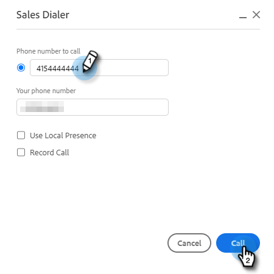

# 呼叫原因 {#call-reasons}

允许您的销售团队在进行呼叫时选择呼叫原因，以便您的团队了解发起呼叫的原因。

>[!NOTE]
>
>**需要管理员权限。**

## 启用呼叫原因 {#enable-call-reasons}

1. 单击齿轮图标，然后选择 **设置**.

   

1. 在“管理员设置”下，选择 **拨号器**.

   

1. 选择 **启用呼叫原因**.

   

1. 选择所需的呼叫原因要求。

   

## 创建调用原因 {#create-call}

1. 单击齿轮图标，然后选择 **设置**.

   

1. 在“管理员设置”下，选择 **拨号器**.

   

1. 单击 **管理调用原因**.

   

1. 在文本字段中输入所需的呼叫原因名称，然后单击 **添加**.

   

## 选择呼叫原因 {#select-a-call-reason}

启用呼叫原因后。 用户在进行调用时可以选择一个。

1. 单击调用按钮以启动拨号器。

   

1. 在拨号器中输入呼叫信息，然后单击 **调用**.

   

1. 选择最能描述调用的调用原因。

   

1. 结束呼叫。

   

1. 记录调用。

   

>[!MORELIKETHIS]
>
>* [记录调用原因和向Salesforce调用结果](/help/marketo/product-docs/marketo-sales-connect/phone/log-call-reasons-and-call-outcomes-to-salesforce.md)
>* [调用结果](/help/marketo/product-docs/marketo-sales-connect/phone/call-outcomes.md)

