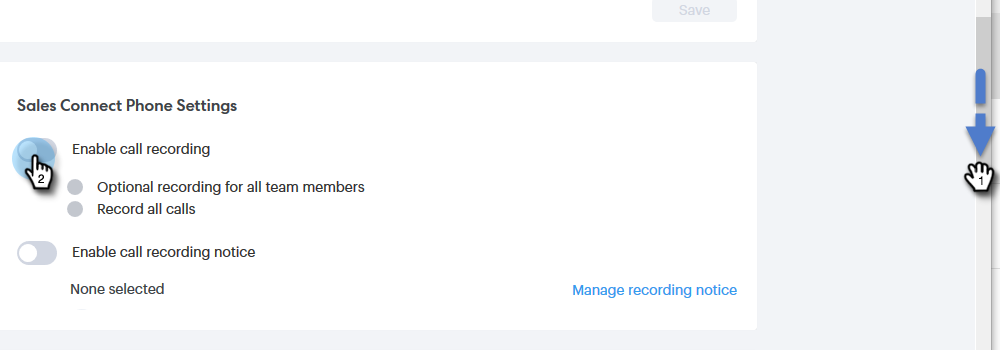

# 启用通话录制 {#enable-call-recording}

作为管理员，您可以为Sales Connect呼叫启用呼叫录制。 记录团队的呼叫可能是指导销售代表了解最佳呼叫实践的好方法。

1. 单击设置图标并选择 **设置**.

   

1. 在管理设置下，单击 **常规**.

   

1. 向下滚动至Sales Connect电话设置，然后选择 **启用通话录制** 切换。

   

1. 如果要让销售者能够自行启用或禁用呼叫录制，请单击 **适用于所有团队成员的可选录制**. 如果要自动记录所有呼叫，请单击 **记录所有呼叫**.

   

>[!MORELIKETHIS]
>
>[双方同意设置](/help/marketo/product-docs/marketo-sales-connect/phone/two-party-consent-settings.md)
