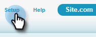
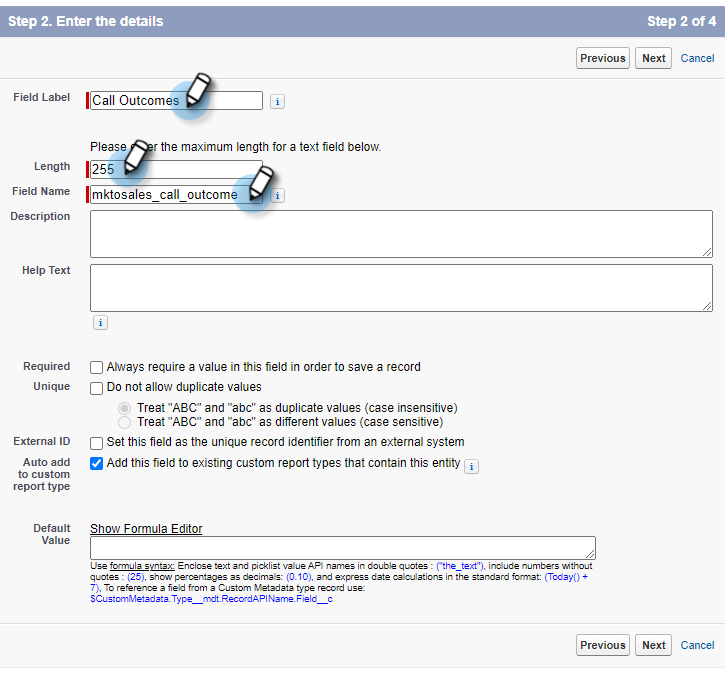
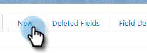
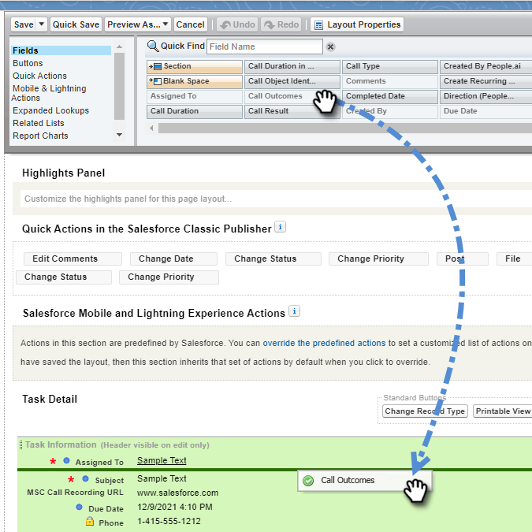

# 将呼叫原因和呼叫结果记录到Salesforce {#log-call-reasons-and-call-outcomes-to-salesforce}

如果您出于报告或可见性的目的，希望将致电结果记录并致电原因至Salesforce，则可以为每个创建自定义活动字段。 每个字段必须使用特定的API名称（在Salesforce中称为“字段名称”）。

* 呼叫结果字段名称：mktosales_call_output
* 致电原因字段名称：mktosales_call_reason

要利用这些字段，您首先需要将字段创建为自定义活动字段。 为了使其对用户可见，您需要将其添加到任务对象页面布局。

## Salesforce Classic {#salesforce-classic}

### 在Salesforce Classic中创建自定义活动字段  {#create-custom-activity-field-in-salesforce-classic}

1. 在Salesforce中，单击 **设置**.

   

1. 在快速查找框中键入“Activities”。

   

1. 单击 **活动自定义字段**.

   

1. 单击 **新建**.

   

1. 选择数据类型“文本”并单击 **下一个**.

   

1. 为自定义字段提供上面定义的字段名称。 字段长度限制为255个字符。 字段标签将是您的销售团队可见的字段，并且可以自定义以满足您团队的需求。

   

1. 其余设置是可选的。 完成配置后，单击 **下一个**.

   

1. 为此字段选择所需的字段级安全设置，然后单击 **下一个** （下图只是一个示例）。

   

   >[!NOTE]
   >
   >确保您的Sales Connect用户所使用的配置文件能够看到自定义字段，并且您还可以在其他位置看到该字段。

1. 选择要将该字段添加到其中的页面布局，然后单击 **保存** (或者，您可以单击 **保存并新建** 对“来电原因”字段重复此过程)。

   

### 在Salesforce Classic中向“任务页面布局”添加自定义活动字段 {#add-custom-activity-field-to-task-page-layout-in-salesforce-classic}

>[!NOTE]
>
>如果您没有在上面的步骤9中选择所需的页面布局，则只需执行以下步骤即可。

1. 在Salesforce中，单击 **设置**.

   

1. 在“快速查找”框中键入“Task”。

   

1. 单击 **任务页面布局**.

   

1. 单击 **编辑** 在要添加此字段的任务页面布局旁边。

   

1. 将该字段拖放到任务页面布局的所需部分。

   

1. 单击 **保存**.

   

## Salesforce Lightning {#salesforce-lightning}

### 在Salesforce Lightning中创建自定义活动字段 {#create-custom-activity-field-in-salesforce-lightning}

1. 在Salesforce中，单击右上角的齿轮图标，然后选择 **设置**.

   

1. 单击 **对象管理器**.

   

1. 在快速查找框中键入“Activity”。

   

1. 单击 **活动** 标签。

   

1. 单击 **字段和关系**.

   

1. 单击 **新建**.

   

### 在Salesforce Lightning中将自定义活动字段添加到任务页面布局 {#add-custom-activity-field-to-task-page-layout-in-salesforce-lightning}

1. 在Salesforce中，单击右上角的齿轮图标，然后选择 **设置**.

   

1. 单击 **对象管理器**.

   

1. 在“快速查找”框中键入“Task”。

   

1. 单击 **任务** 标签。

   

1. 单击 **页面布局**.

   

1. 单击您要将此字段添加到的任务页面布局。

   

1. 将该字段拖放到任务页面布局的所需部分。

   

1. 单击 **保存**.

   

>[!MORELIKETHIS]
>
>[在活动历史记录中安装Sales Connect事件字段](/help/marketo/product-docs/marketo-sales-connect/crm/salesforce-customization/install-sales-connect-event-fields-on-activity-history.md)
