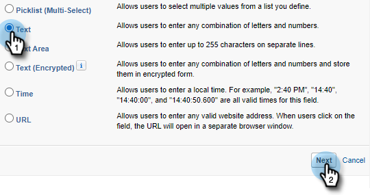

# 记录调用原因和向Salesforce调用结果 {#log-call-reasons-and-call-outcomes-to-salesforce}

如果出于报告或可见性目的要记录调用结果并向Salesforce调用原因，则可以为每个活动创建一个自定义活动字段。 每个字段必须使用特定的API名称（在Salesforce中称为“字段名称”）。

* 调用结果字段名称：mktosales_call_outde
* 调用原因字段名称：mktosales_call_reason

要使用这些字段，您首先需要将该字段创建为自定义活动字段。 为了让用户可见，您需要将其添加到任务对象页面布局中。

## Salesforce Classic {#salesforce-classic}

### 在Salesforce Classic中创建自定义活动字段  {#create-custom-activity-field-in-salesforce-classic}

1. 在Salesforce中，单击 **设置**.

   

1. 在“快速查找”框中键入“活动”。

   

1. 单击 **活动自定义字段**.

   

1. 单击 **新建**.

   

1. 选择数据类型“Text”，然后单击 **下一个**.

   

1. 为自定义字段指定上面定义的字段名称。 字段长度限制为255个字符。 字段标签将是您的销售团队可见的字段，并且可以根据您团队的需求进行自定义。

   

1. 其余设置是可选的。 完成配置后，单击 **下一个**.

   

1. 为此字段选择所需的字段级安全设置，然后单击 **下一个** （下图仅是一个示例）。

   

   >[!NOTE]
   >
   >确保自定义字段对Sales Connect用户使用的配置文件可见，以及您希望看到的任何其他字段。

1. 选择要将字段添加到的页面布局，然后单击 **保存** （可选）您可以单击 **保存并新建** 并为呼叫原因字段重复该过程)。

   

### 在Salesforce Classic中，将自定义活动字段添加到任务页面布局 {#add-custom-activity-field-to-task-page-layout-in-salesforce-classic}

1. 在Salesforce中，单击 **设置**.

   

1. 在“快速查找”框中键入“任务”。

   

1. 单击 **任务页面布局**.

   

1. 单击 **编辑** 要将此字段添加到的任务页面布局旁边。

   

1. 将字段拖放到任务页面布局中。

   PICC

1. 单击 **保存**.

   PICC

## Salesforce闪电 {#salesforce-lightning}

### 在Salesforce闪电中创建自定义活动字段 {#create-custom-activity-field-in-salesforce-lightning}

1. 在Salesforce中，单击右上方的齿轮图标。

PICC

1. 单击 **设置**.

PICC

1. 单击 **对象管理器**.

PICC

1. 在“快速查找”框中输入活动，然后单击活动标签以打开对象的设置。

PICC

1. 在左侧，单击 **字段和关系**.

PICC

1. 单击 **新建**.

PICC

## 在Salesforce闪电中，将自定义活动字段添加到任务页面布局 {#add-custom-activity-field-to-task-page-layout-in-salesforce-lightning}

1. 在Salesforce中，单击右上方的齿轮图标。

PICC

1. 单击 **设置**.

PICC

1. 转到设置。?????????

PICC

1. 在“快速查找”框中键入“任务”。

PICC

1. 单击任务。

PICC

1. 单击“页面布局”。

PICC

1. 单击要将此字段添加到的任务页面布局。

PICC

1. 将字段拖放到任务页面布局中。

PICC

1. 单击保存。

PICC

>[!MORELIKETHIS]
>
>[在活动历史记录中安装Sales Connect事件字段](/help/marketo/product-docs/marketo-sales-connect/crm/salesforce-customization/install-sales-connect-event-fields-on-activity-history.md)
