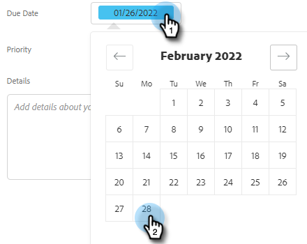

# 创建和分配提醒任务 {#create-and-assign-reminder-tasks}

提醒任务是了解客户和潜在客户参与情况的好方法。 要创建任务，请执行以下步骤。

1. 单击 **指挥中心**.

   

1. 默认情况下会打开任务。 单击 **添加任务**.

   

1. 从Email、Call、InMail或Custom Task中选择任务类型。

   

1. 为任务命名。

   

1. 选择保留分配给自己的任务，或选择另一个用户将您的任务分配给。

   

1. 通过此提醒任务添加跟进人员。

   

1. 选择任务到期日期。

   

1. 选择任务的优先级。

   

1. 添加您希望在完成任务时可以使用的任务的任何详细信息，例如通话笔记、InMail消息模板甚至有关人员的笔记。 单击 **创建** 完成时。

   
