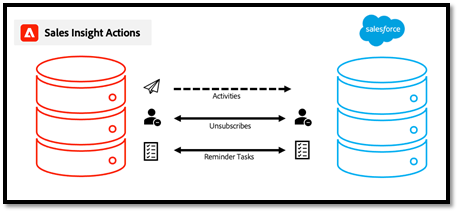

# 操作数据同步常见问题解答 {#actions-data-sync-faq}

Sales Insight Actions的Marketo Engage统一字段同步使系统能够将人员信息从您的Sales Insight Actions数据库提取到Sales Insight Actions数据库中。

这可在Sales Insight Actions Web应用程序中提供最新的人员数据，并允许系统为Marketo中的相应人员记录和Salesforce中的潜在客户/联系人/帐户/机会记录收集唯一ID，以便记录可以被正确引用以用于记录数据。

此同步可从Marketo Engage“管理员”部分的Sales Insight操作配置选项卡中启用。 有关详细信息，请参阅 [启动数据同步](/help/marketo/product-docs/marketo-sales-insight/actions/getting-started/msi-actions-admin-guide.md#initiate-data-sync).

上图显示了人员活动和任务数据如何在系统之间同步。 请注意以下事项：

* 人员记录会从Marketo Engage同步到“销售分析操作”，从而使“销售分析操作”人员数据的真实来源Marketo Engage
* Marketo Engage和销售分析操作 [有机制](/help/marketo/product-docs/marketo-sales-insight/actions/email/unsubscribes/syncing-unsubscribes-with-salesforce.md) 用于收集和同步取消订阅状态到Salesforce
* 取消订阅状态不会从“销售活动”同步到“Marketo Engage”，但可以将“销售分析活动”配置为在允许销售者发送电子邮件之前，检查人员的Marketo取消订阅状态 [Marketo取消订阅检查](/help/marketo/product-docs/marketo-sales-insight/actions/email/unsubscribes/marketo-unsubscribe-check.md).

以下是一些与数据统一同步工作方式相关的常见问题。

## 哪些潜在客户/联系人会同步到Sales Insight操作？ {#what-lead-contacts-are-synced}

如果潜在客户和联系人的销售责任人已分配给他们，则他们将同步到销售操作中。

您可以通过查看存在的标准责任人字段，在Salesforce中，查看潜在客户/联系人是否具有销售责任人。

销售所有者不必是Marketo同步用户或任何特定的Salesforce或销售用户。 我们只需在Salesforce中列出的潜在客户所有者和联系人所有者字段中列出一个用户，这样我们就可以将其识别为销售潜在客户并将其同步到Sales Insight操作。 我们与同步的字段的任何更新也将在Sales Insight Actions中检测并更新。

## Sales Insight Smart Grid中显示的活动数据从哪里获得来源？ {#where-does-the-activity-data-get-sourced-from}

活动数据（如电子邮件、调用、有趣时刻和Web）均源自Marketo Engage的数据库。 Sales Insight Smart Grid向Marketo Engage实例发出请求，以在每次销售用户加载Sales Insight面板时检索此实例。

为确保所有活动数据都可以源自Marketo Engage, Sales Insight Actions会将所有活动数据同步到Marketo Engage。

## 与人员记录相关的哪些字段从Marketo Engage同步到Sales Insight Actions? {#what-fields-sync}

有11个字段可从Marketo Engage同步到Sales Insight操作：

* 名字
* 姓氏
* Salesforce联系人ID
* Salesforce潜在客户ID
* Marketo ID
* 公司
* 标题
* 电子邮件
* 电话号码
* Linkedin URL
* 源

## 在Marketo Engage和Sales Insight Actions之间同步的字段是否可配置？ {#are-the-fields-that-sync-configurable}

配置哪些Marketo Engage字段同步到Sales Insight Actions不可用，也无法映射字段。 从Marketo的同步会自动将标准Marketo字段映射到您的Sales Action实例中的标准字段。

## Sales Insight Actions为何有其自己的数据库？ {#why-does-actions-have-its-own-database}

Sales Insight Actions有其自己的Web应用程序，其中具有专用的人员和活动数据库，可提供针对销售团队构建和设计的优化工作区。 这样，销售经理和销售人员就可以有空间构建和管理其参与策略，而无需授予对主Marketo Engage工作区的访问权限或权限，该工作区已针对营销运营专家进行了优化。

## 如何处理重复项？ {#how-are-duplicates-handled}

您的“销售活动”数据库将是您的Marketo Engage数据库中存在的那些合格人员（销售责任人的潜在客户/联系人）的副本。 这意味着，如果在Marketo中创建了两个具有相同电子邮件地址的记录，则在Sales Actions中将创建一个重复的记录。

## 完成初始同步需要多长时间？ {#how-long-initial-sync}

将所有销售线索数据同步到新的销售分析操作实例的初始过程通常每1到2分钟处理1,000人。 这只是一种估计，可能有所不同。

一旦进行初始同步并且所有销售线索都已填充到您的Sales Insight Actions Web应用程序实例中，就会有一个增量同步，每次更新一个受支持的字段时都会运行该同步。

## Sales Insight Actions用户是否可以从Actions Web应用程序中编辑人员数据？ {#can-actions-users-edit-people-data}

不能，在Actions中创建和编辑人员记录的功能不适用于Actions Web应用程序的用户和管理员。 必须在Salesforce或Marketo Engage中创建和编辑人员。 Sales Insight Actions通过持续同步新数据来使用Marketo作为人员数据的真实来源，因此，如果人员是通过Marketo中的工作流在Marketo中更新或创建，或者从Salesforce中同步，则这些更新将传递到Sales Insight Actions Web应用程序数据库。

## 销售活动是否登录Marketo? {#do-sales-activities-log-to-marketo}

是，销售参与活动将作为本机活动登录到Marketo。 这些活动还包括本机过滤器，可与约束一起使用，以根据销售活动属性定位潜在客户。

以下是登录到Marketo的活动列表：

* 发送销售电子邮件
* 打开销售电子邮件
* 单击“销售电子邮件”
* 已回复销售电子邮件
* 销售电子邮件退回
* 已接到销售电话
* 添加到Sales Campaign
* 从Sales Campaign中删除

## 销售活动是否登录到Salesforce? {#do-sales-activities-log-to-salesforce}

是的，销售参与活动将作为本机任务登录到Salesforce。 然后，这些任务可在Salesforce报表中使用，以支持跟踪销售活动的团队功能板。

Sales Insight Actions允许管理员配置将哪些销售活动记录到Salesforce。 这些活动包括电子邮件、调用和打开提醒任务。

上图显示了哪些信息已记录到Salesforce。 电子邮件和调用等活动将记录到 [单向同步](/help/marketo/product-docs/marketo-sales-insight/actions/crm/salesforce-integration/salesforce-sync-settings.md). [取消订阅](/help/marketo/product-docs/marketo-sales-insight/actions/email/unsubscribes/syncing-unsubscribes-with-salesforce.md) 和 [提醒任务](/help/marketo/product-docs/marketo-sales-insight/actions/tasks/reminder-task-sync-with-salesforce.md) 通过双向同步保持为最新。 这些数据同步中的每个都可以从Sales Insight Actions Web应用程序界面进行配置。

>[!MORELIKETHIS]
>
>* [正在将取消订阅与Salesforce同步](/help/marketo/product-docs/marketo-sales-insight/actions/email/unsubscribes/syncing-unsubscribes-with-salesforce.md)
>* [Marketo取消订阅检查](/help/marketo/product-docs/marketo-sales-insight/actions/email/unsubscribes/marketo-unsubscribe-check.md)
>* [Salesforce同步设置](/help/marketo/product-docs/marketo-sales-insight/actions/crm/salesforce-integration/salesforce-sync-settings.md)
>* [提醒任务与Salesforce同步](/help/marketo/product-docs/marketo-sales-insight/actions/tasks/reminder-task-sync-with-salesforce.md)
>* [启动数据同步](/help/marketo/product-docs/marketo-sales-insight/actions/getting-started/msi-actions-admin-guide.md#initiate-data-sync)

