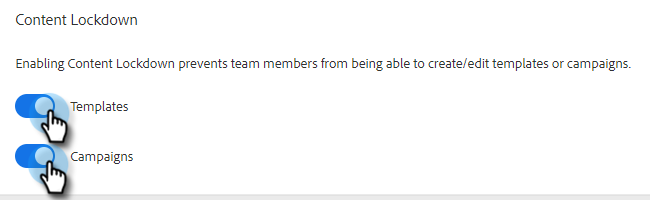

# 内容锁定 {#content-lockdown}

启用内容锁定后，限制非管理员用户编辑模板和/或营销活动。 用户将无法：共享、克隆、编辑或删除内容。 他们也无法选择存档模板。

>[!NOTE]
>
>用户在发送或启动营销活动时仍能编辑电子邮件的内容。

1. 单击齿轮图标，然后选择 **设置**.

   

1. 在“管理员设置”下，单击 **常规**.

   

1. 向下滚动到内容锁定。 打开任一滑块将禁用团队成员创建/编辑模板和/或营销策划的功能。

   
