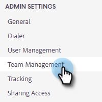
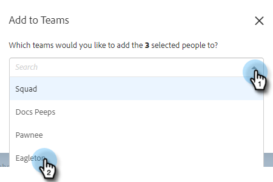

# 创建团队 {#creating-a-team}

通过创建团队，可以组合一组用户，以便与其共享内容，并按过滤报表。

## 创建团队 {#create-a-team}

1. 在 [Web应用程序](https://toutapp.com/login)，请单击齿轮图标并选择 **设置**.

   

1. 在“管理员设置”下，选择 **团队管理**.

   

1. 在“团队”旁边，单击 **+** 图标。

   

1. 输入团队名称并单击 **创建**.

   

>[!NOTE]
>
>您现在可以与该团队共享模板、营销活动和群组。

## 将人员添加到团队 {#add-people-to-a-team}

1. 仍在团队管理中，选择 **所有成员**.

   

1. 找到要添加到团队的用户并选中其复选框。

   

1. 单击 **添加到团队**.

   

1. 单击下拉列表，然后选择所需的团队。

   

1. 单击 **添加** 完成时。

   
