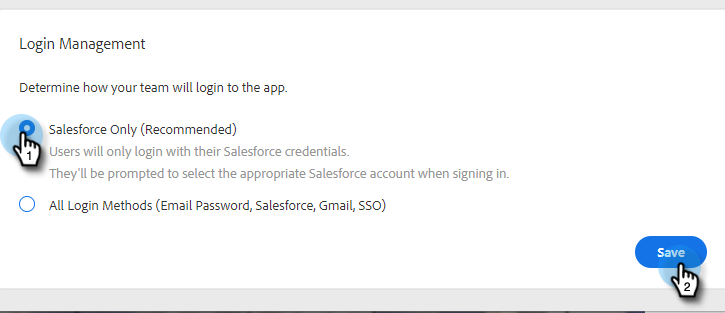
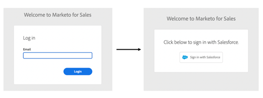

# 登录管理设置 {#login-management-settings}

“登录管理”设置允许管理员在全局级别为Sales Insight Actions用户设置身份验证首选项。

>[!NOTE]
>
>默认情况下，将为“销售分析活动”实例选择“仅限Salesforce”选项。 我们建议使用此设置，以便用户能够 [自动登录](/help/marketo/product-docs/marketo-sales-insight/actions/admin/auto-login-from-salesforce.md) 从Salesforce。

## 更新登录管理设置 {#update-login-management-settings}

>[!NOTE]
>
>**需要管理员权限**

要更新登录管理首选项，请执行以下步骤。

1. 单击齿轮图标，然后选择 **设置**.

   

1. 在“管理员设置”下，单击 **常规**.

   

1. 向下滚动到登录管理卡，然后选择所需的设置（在本示例中，我们选择的是“仅限Salesforce”）。 单击 **保存** 完成时。

   

## 仅限Salesforce常见问题解答 {#salesforce-only-faq}

“仅限Salesforce”表示用户只能通过身份验证以在Salesforce中使用Sales Insight Actions。 它是Sales Insight Actions实例的默认选项，因为它允许用户进行无缝身份验证，而无需管理用户名和密码，因此建议使用此选项。

### 选择“仅限Salesforce”时，我实例的新用户如何激活其帐户？ {#activate-when-salesforce-only-is-selected}

单击 **快速入门** 按钮，新用户将被发送到帐户激活屏幕，在该屏幕中，新用户需要连接其Salesforce实例以激活其Sales Insight Actions帐户。

### 选择“仅限Salesforce”时，允许我的用户通过哪些身份验证方法进行身份验证？ {#what-authentication-methods}

当导航到登录屏幕时，用户将首先输入其电子邮件地址。 然后，他们将单击Salesforce一键登录按钮，在该按钮中，他们可以使用登录到的Salesforce帐户进行身份验证。

>[!NOTE]
>
>这仅适用于直接导航到登录屏幕的用户。 从Salesforce访问Actions的用户将使用登录 [自动登录](/help/marketo/product-docs/marketo-sales-insight/actions/admin/auto-login-from-salesforce.md).

### 当用户访问Salesforce中的“操作”功能并选择“仅限Salesforce”时，如何处理操作的用户身份验证？ {#how-is-user-authentication-handled}

当用户单击其中一个操作（呼叫、电子邮件、营销活动、任务、营销活动列表等）时，我们会使用其SFDC身份验证自动将其登录到其Sales Insight Actions帐户。 我们称此身份验证为 [自动登录](/help/marketo/product-docs/marketo-sales-insight/actions/admin/auto-login-from-salesforce.md).

## 所有登录方法常见问题解答 {#all-login-methods-faq}

### 选择“所有登录方法”后，我实例的新用户如何激活其帐户？ {#activate-when-all-login-methods-is-selected}

当邀请新用户加入实例时，他们将收到一封帐户激活电子邮件。 用户将单击显示“开始”的按钮，随后该按钮会将用户引导至要求他们创建并确认密码的页面。 创建后，将激活其帐户，并通过载入工作流对其进行识别。

### 选择“所有登录方法”后，允许我的实例的用户使用登录哪些内容？ {#what-are-users-allowed-to-log-in-with-all-login}

使用我们的登录页面时，用户将首先输入其电子邮件地址。 然后，这些用户档案将被发送到一个页面，该页面会为他们提供所有登录选项（用户名/密码、SFDC、Gmail、SSO），以便进行身份验证。
