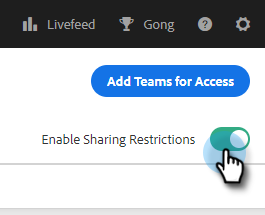
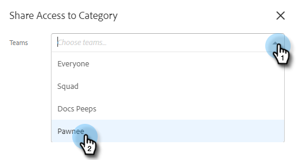
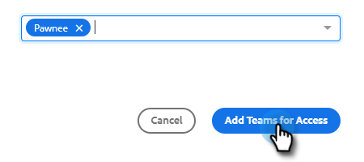

# 共享设置 {#sharing-settings}

通过限制用户可以共享的内容以及与哪些类别共享，更好地管理您的模板。

首次创建Sales Insight Actions帐户时，将启用“共享设置”。 这可以让您的帐户管理员在打开存储库并允许用户将内容共享到您的团队类别之前，创建和组织您的模板类别。

启用“共享设置”后，只有管理员才能共享到不同类别中，除非向团队或每个人都提供共享权限。 禁用共享设置后，没有任何限制，所有用户都可以共享到任何模板类别中。

## 配置共享设置 {#configure-your-sharing-settings}

1. 在[Web应用程序](https://toutapp.com/login)中，单击齿轮图标并选择&#x200B;**[!UICONTROL Settings]**。

   

1. 在[!UICONTROL Admin Settings]下，选择&#x200B;**[!UICONTROL Sharing Access]**。

   

1. 确保&#x200B;**[!UICONTROL Sharing Settings]**&#x200B;已启用。 这意味着默认情况下，只有管理员能够共享模板类别中的模板。

   

1. 选择要配置的模板类别。

   

1. 单击 **[!UICONTROL Add Teams for Access]**。

   

1. 选择要添加的团队。

   

   >[!NOTE]
   >
   >如果您没有看到任何团队，则需要转到团队管理并创建用户团队。

1. 单击&#x200B;**[!UICONTROL Add Teams for Access]**&#x200B;进行保存。

   

1. 现在您的团队已添加，您可以选择仅允许团队管理员共享该团队的所有用户。 在此示例中，我们将授予SDR团队中的所有用户共享访问权限。

   
