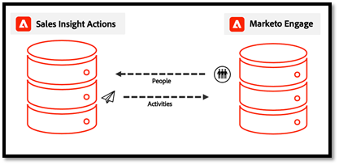

# 将销售操作数据与 Marketo 和 Salesforce 同步 {#sync-sales-action-data-with-marketo-and-salesforce}

通过Sales Insight Actions的数据统一字段同步，系统可以将人员信息从Marketo Engage数据库提取到Sales Insight Actions数据库中。

这在Sales Insight Actions Web应用程序中提供了最新的人员数据，并允许系统收集Marketo中相应人员记录的唯一ID以及Salesforce中的潜在客户/联系人/帐户/机会记录，以便能够正确引用记录以供记录数据使用。

此同步可以从Marketo Engage的“管理员”部分的“Sales Insight Actions Config”选项卡中启用。 有关详细信息，请查看[启动数据同步](/help/marketo/product-docs/marketo-sales-insight/actions/getting-started/sales-insight-actions-admin-setup-guide.md#initiate-data-sync)。

上图显示了人员活动和任务数据如何在系统之间同步。 需要注意以下几点：

* 人员记录将从Marketo Engage同步到Sales Insight Actions，从而使Marketo Engage成为Sales Insight Actions人员数据的事实来源
* Marketo Engage和Sales Insight操作[都有一个机制](/help/marketo/product-docs/marketo-sales-insight/actions/email/unsubscribes/syncing-unsubscribes-with-salesforce.md)，用于收集取消订阅状态并将其同步到Salesforce
* 取消订阅状态不会从Sales Actions同步到Marketo Engage，但可以将Sales Insight Actions配置为先检查人员的Marketo Unsubscribe状态，然后再允许销售人员发送包含[Marketo Unsubscribe Check](/help/marketo/product-docs/marketo-sales-insight/actions/email/unsubscribes/marketo-unsubscribe-check.md)的电子邮件。

以下是有关数据统一同步如何工作的一些常见问题。

## 哪些潜在客户/联系人同步到Sales Insight Actions？ {#what-lead-contacts-are-synced}

分配给销售负责人的销售线索和联系人将同步到Sales Actions。

您可以通过查看现有的标准所有者字段来查看潜在客户/联系人在Salesforce中是否有销售所有者。

销售负责人不必是Marketo同步用户或任何特定的Salesforce或销售用户。 我们只需在Salesforce中列出的“潜在客户所有者和联系人所有者”字段中列出一个用户，以便我们能够将它识别为销售潜在客户，并将其同步到Sales Insight Actions中。 与我们同步的字段的任何更新也将在Sales Insight操作中检测和更新。

## Sales Insight智能网格中显示的活动数据源自何处？ {#where-does-the-activity-data-get-sourced-from}

电子邮件、电话、有趣的时刻和Web等活动数据均源自Marketo Engage的数据库。 Sales Insight智能网格会向Marketo Engage实例发出请求，以便在每次销售用户加载Sales Insight面板时检索此内容。

为确保所有活动数据均可来自Marketo Engage，Sales Insight Actions会将所有活动数据同步到Marketo Engage。

## 哪些与从Marketo Engage同步到Sales Insight Actions的人员记录相关的字段？ {#what-fields-sync}

有11个字段会从Marketo Engage同步到Sales Insight Actions：

* 名字
* 姓氏
* Salesforce联系人Id
* Salesforce潜在客户ID
* Salesforce帐户ID
* Salesforce机会ID
* Marketo ID
* 公司
* 标题
* 电子邮件
* 电话号码
* Linkedin URL
* 来源

## 在Marketo Engage和Sales Insight Actions之间同步的字段是否可以配置？ {#are-the-fields-that-sync-configurable}

无法配置同步到Sales Insight操作的哪些Marketo Engage字段，也无法映射字段。 从Marketo同步会自动将标准Marketo字段映射到销售活动实例中的标准字段。

## 为什么Sales Insight Actions有自己的数据库？ {#why-does-actions-have-its-own-database}

Sales Insight Actions拥有自己的Web应用程序，该应用程序具有专门的人员和活动数据库，可提供为销售团队构建和设计的优化工作区。 这使销售经理和销售人员能够腾出空间来构建和管理他们的参与策略   无需授予主Marketo Engage工作区的访问权限或特权，该工作区已针对营销操作专家进行了优化。

## 如何处理重复项？ {#how-are-duplicates-handled}

您的Sales Actions数据库将成为Marketo Engage数据库中存在的合格人员（具有销售负责人的潜在客户/联系人）的副本。 这意味着，如果在Marketo中创建了具有相同电子邮件地址的两个记录，则在Sales Actions中将创建一个重复的记录。

## 完成初始同步需要多长时间？ {#how-long-initial-sync}

将所有销售线索数据同步到新的Sales Insight Actions实例的初始流程通常每1-2分钟处理大约1,000人。 这只是个估计值，可能会有所不同。

执行初始同步并将您的所有潜在客户填充到您的Sales Insight Actions Web应用程序实例后，将会有一个增量同步，每次更新已同步的某个受支持字段时，该同步都会运行。

## Sales Insight Actions用户能否从Actions Web应用程序中编辑人员数据？ {#can-actions-users-edit-people-data}

不能，在“操作”Web应用程序的用户和管理员都不能创建和编辑“操作”中的人员记录。 必须在Salesforce或Marketo Engage中创建和编辑人员。 Sales Insight Actions通过不断同步新数据来使用Marketo作为人员数据的真实来源，因此，如果在Marketo中通过Marketo中的工作流更新或创建人员，或者从Salesforce同步人员，则这些更新将传递到Sales Insight Actions Web应用程序数据库。

## 销售活动是否记录到Marketo？ {#do-sales-activities-log-to-marketo}

是，销售参与活动将作为本机活动登录到Marketo。 这些活动还包括本机过滤器，可与约束一起使用，以根据销售活动属性定位潜在客户。

以下是登录到Marketo的活动列表：

* 发送销售电子邮件
* 打开销售电子邮件
* 点击销售电子邮件
* 已回复销售电子邮件
* 销售电子邮件已退回
* 已收到的销售电话
* 添加到销售活动
* 已从销售活动中移除

## 销售活动是否记录到Salesforce？ {#do-sales-activities-log-to-salesforce}

是的，销售参与活动将作为本机任务登录到Salesforce。 然后，这些任务可以在Salesforce报表中使用，为跟踪销售活动的团队功能板提供支持。

Sales Insight Actions允许管理员配置哪些销售活动记录到Salesforce。 这些活动包括电子邮件、呼叫和打开提醒任务。

上图显示了记录到Salesforce中的信息。 电子邮件和呼叫等活动通过[单向同步](/help/marketo/product-docs/marketo-sales-insight/actions/crm/salesforce-integration/sync-sales-activities-to-salesforce.md)记录到Salesforce。 [取消订阅](/help/marketo/product-docs/marketo-sales-insight/actions/email/unsubscribes/syncing-unsubscribes-with-salesforce.md)和[提醒任务](/help/marketo/product-docs/marketo-sales-insight/actions/tasks/reminder-task-sync-with-salesforce.md)通过双向同步保持最新。 其中每个数据同步都可以从Sales Insight Actions Web应用程序界面进行配置。

>[!MORELIKETHIS]
>
>* [正在与Salesforce同步取消订阅](/help/marketo/product-docs/marketo-sales-insight/actions/email/unsubscribes/syncing-unsubscribes-with-salesforce.md)
>* [Marketo取消订阅检查](/help/marketo/product-docs/marketo-sales-insight/actions/email/unsubscribes/marketo-unsubscribe-check.md)
>* [将销售活动同步到Salesforce](/help/marketo/product-docs/marketo-sales-insight/actions/crm/salesforce-integration/sync-sales-activities-to-salesforce.md)
>* [提醒任务与Salesforce同步](/help/marketo/product-docs/marketo-sales-insight/actions/tasks/reminder-task-sync-with-salesforce.md)
>* [启动数据同步](/help/marketo/product-docs/marketo-sales-insight/actions/getting-started/sales-insight-actions-admin-setup-guide.md#initiate-data-sync)
