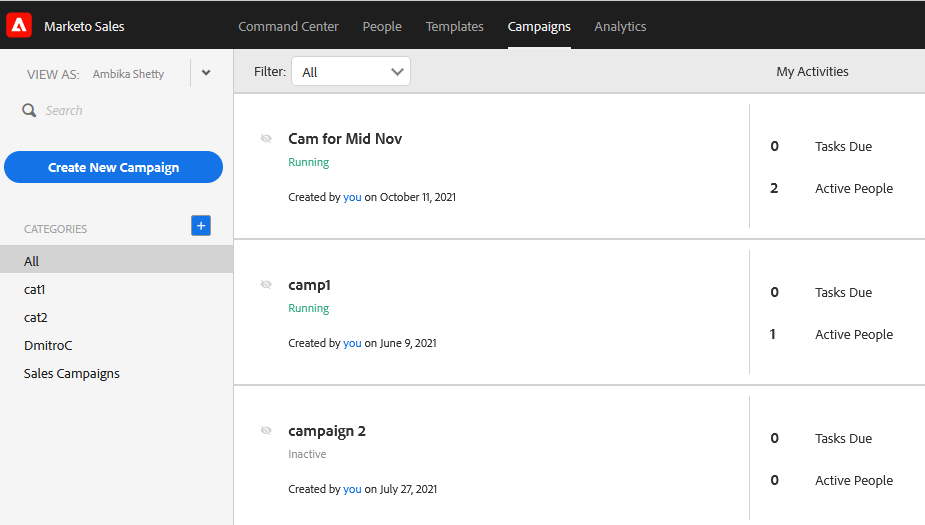

# 用户访问详细信息 {#user-access-details}

管理员和非管理员有权访问哪些内容？

## 管理员用户权限 {#admin-user-permissions}

管理员可以 [查看所有模板](/help/marketo/product-docs/marketo-sales-connect/templates/view-template-list-as-another-user.md).

管理员可以 [查看所有营销活动](/help/marketo/product-docs/marketo-sales-connect/campaigns/view-campaigns-list-as-another-user.md).

管理员可以查看所有电子邮件活动。

管理员可以查看正在运行的营销活动中的所有人员。

管理员可以使用“查看方式”下拉菜单查看用户促销活动和促销活动类别。

管理员可以代表用户停止营销活动。

## 非管理员用户权限 {#non-admin-user-permissions}

* Analytics:

   * 用户可以查看团队分析
   * 用户可以只深入了解他们所属的团队
   * 用户可以查看自己的分析

* 人员页面：

   * 用户可以与所有人共享组
   * 用户可以仅与他们所属的团队共享组
   * 用户可以查看Actions数据库中的所有人员
   * 删除用户后，其共享联系人会将所有权转移给删除该用户的主控管理员

* “团队管理”页：

   * 无法查看

* “模板”页面：

   * 用户可以与所有人共享模板
   * 用户可共享其管理员允许的类别中的模板
   * 从团队中删除用户时，其模板将取消与该团队共享
   * 从团队中删除用户时，其模板会将所有权转移给删除该用户的主控管理员
