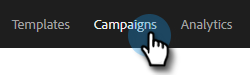
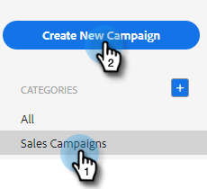

# 创建销售活动 {#create-a-sales-campaign}

销售促销活动是一系列多渠道步骤，包括：电子邮件、电话、InMail和自定义任务。 它们允许您简化与潜在客户和现有客户的通信。

借助销售促销活动，您可以：

* **组织**：在一个位置简化所有外联活动，以便有效执行。
* **缩放**：安排所有外联工作，以便扩大工作规模、最大程度地减少手动操作，并根据需要进行个性化。
* **衡量**：在一个位置跟踪所有电子邮件和任务的成功，同时自动将其登录到Salesforce。 通过了解哪些因素能引起共鸣并导致结果，您可以持续测试和改进结果。

那么，如何设置促销活动？

1. 单击 **营销活动** 选项卡。

   

1. 选择类别并单击 **创建新营销活动** 按钮。

   

   >[!NOTE]
   >
   >通过单击 **+** 旁边 **类别**.

1. 将选择您选择的类别。 如果您改变了主意，请单击下拉菜单并选择其他菜单。 完成后，单击 **继续**.

   

1. 单击 **添加步骤**.

   

1. 在电子邮件、呼叫、InMail或自定义任务之间选择。 在本例中，我们选择“电子邮件”。

   

1. 当您 [使用您的电子邮件完成](/help/marketo/product-docs/marketo-sales-insight/actions/campaigns/sales-campaign-step-types-and-reminder-tasks.md#email){target="_blank"}，单击 **添加**.

   

1. 创建第一天和步骤后，“添加一天”按钮将激活，您可以添加销售流程所需的天数和步骤。

   

   >[!NOTE]
   >
   >“天数”不是操作之间的间隔天数，而是序列中的天数。 例如，如果您的促销活动将持续7天，则输入“3”表示该操作将在7月3日执行， **非** 3天后。

1. 确保自定义计划和回复选项，例如，通过访问 **“设置”选项卡** 促销活动。

   

现在该开始添加人员了！

>[!MORELIKETHIS]
>
>* [销售活动步骤类型和提醒任务](/help/marketo/product-docs/marketo-sales-insight/actions/campaigns/sales-campaign-step-types-and-reminder-tasks.md){target="_blank"}
>* [Sales Campaign设置](/help/marketo/product-docs/marketo-sales-insight/actions/campaigns/sales-campaign-settings.md){target="_blank"}

