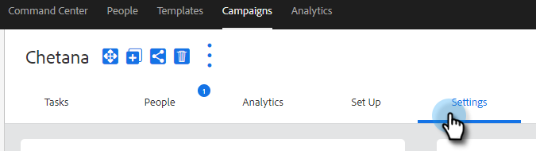

# 销售活动设置 {#sales-campaign-settings}

利用“销售活动设置”部分，可配置特定的销售活动，使其能够最适合您团队对该活动的用例。

## 跳过周末 {#skip-weekends}

允许跳过周末，以便周末（星期六或星期日）发生的任何步骤都将移至星期一。

>[!NOTE]
>
>启用“跳过周末”后，电子邮件将基于5天的周进行计划。 这意味着，在计划步骤时，周末将被忽略为天。

1. 单击 **促销活动**.

   

1. 选择所需的营销活动。

   

1. 单击 **设置** 选项卡。

   

1. 选择 **跳过周末** 复选框。

   

## 退回时删除 {#remove-on-bounce}

如果您使用电子邮件连接，我们将根据发送给用户收件箱的退回消息来检测退回。 此外，我们还可以在检测到跳出时从营销活动中删除人员。

1. 单击 **促销活动**.

   

1. 选择所需的营销活动。

   

1. 单击 **设置** 选项卡。

   

1. 选择 **退回时删除** 复选框。

   

## 如果发生回复 {#if-a-reply-occurs}

如果您为Gmail或Exchange启用了回复跟踪，则当收件人回复您的电子邮件时，我们可以自动结束您的销售活动。

1. 单击 **促销活动**.

   

1. 选择所需的营销活动。

   

1. 单击 **设置** 选项卡。

   

1. 在 **如果发生回复**，进行所需的选择。

   

>[!MORELIKETHIS]
>
>* [创建销售活动](/help/marketo/product-docs/marketo-sales-insight/actions/campaigns/create-a-sales-campaign.md){target=&quot;_blank&quot;}
>* [了解电子邮件步骤的Sales Campaign发送选项](/help/marketo/product-docs/marketo-sales-insight/actions/campaigns/understanding-sales-campaign-send-options-for-email-steps.md){target=&quot;_blank&quot;}
>* [销售活动步骤类型和提醒任务](/help/marketo/product-docs/marketo-sales-insight/actions/campaigns/sales-campaign-step-types-and-reminder-tasks.md){target=&quot;_blank&quot;}

