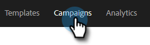

# 以其他用户的身份查看营销活动列表 {#view-campaigns-list-as-another-user}

作为管理员，您可以以任何用户身份查看营销活动。

>[!NOTE]
>
>**需要管理员权限**

1. 在Web应用程序中，单击 **促销活动**.

   

1. 单击 **查看方式** 下拉菜单，然后选择所需的用户。

   

1. 现在，您以选定用户的身份查看营销活动。

   

   >[!NOTE]
   >
   >您还可以使用过滤器或搜索功能以及查看方式来查看与您最相关的内容。
