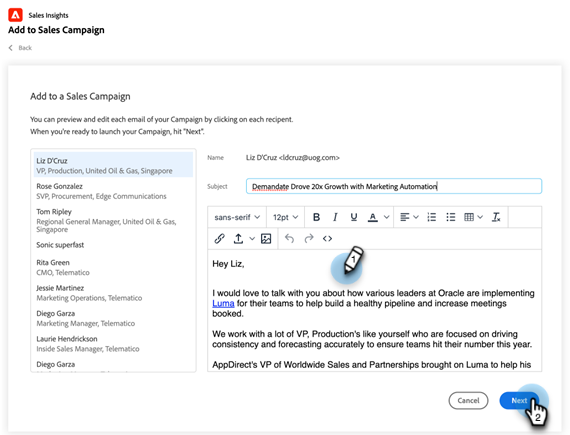

# 在Salesforce中使用批量添加到Sales Campaign {#using-bulk-add-to-sales-campaign-in-salesforce}

了解如何在Salesforce中批量添加到Sales Campaign，以帮助使用Sales Actions扩展出站通信。

>[!NOTE]
>
>Salesforce强制实施一次可选择200条记录的限制。

>[!PREREQUISITES]
>
>请确保您已将[最新的Sales Insight包](/help/marketo/product-docs/marketo-sales-insight/msi-for-salesforce/upgrading/upgrading-your-msi-package.md){target="_blank"}安装到您的Salesforce实例，并在Salesforce中的联系人和潜在客户列表视图中配置了[操作按钮](/help/marketo/product-docs/marketo-sales-insight/actions/crm/salesforce-package-configuration/add-action-buttons-to-salesforce-list-view.md){target="_blank"}。

## 在Salesforce Lightning中批量添加到Sales Campaign {#bulk-add-to-sales-campaign-in-salesforce-lightning}

1. 在Salesforce中，通过单击&#x200B;**潜在客户/联系人**&#x200B;选项卡，导航到潜在客户/联系人主页。

   

1. 在&#x200B;**视图**&#x200B;下拉列表中，选择要通过电子邮件发送的潜在客户/联系人视图。

   >[!TIP]
   >
   >您可以通过单击右侧的齿轮图标并选择&#x200B;**新建**&#x200B;来创建新视图。 为视图指定新名称并保存它后，您可以单击右侧的过滤器图标以帮助向下过滤到要通过电子邮件发送的潜在客户/联系人集。

1. 选择所需的潜在客户或联系人列表，然后单击&#x200B;**添加到销售活动**&#x200B;按钮。

   

1. 此时您将会导航到Actions Sales Campaign模式窗口，并显示您选择的收件人。

1. 进行任何删除人员或组所需的编辑，然后单击&#x200B;**下一步**。

   

1. 从“类别”下拉列表中选择要使用的销售活动类别。

1. 选择要添加选定人员的促销活动，然后单击&#x200B;**下一步**。

   

1. 根据营销活动中的第一步，您可能会看到不同的选项。 如果您的第一步是发送电子邮件，则可以选择编辑每个收件人的电子邮件，如下所示。 完成后，单击&#x200B;**下一步**。

   

1. 同样，如果您的第一步是电子邮件，并且您将其配置为允许您选择促销活动何时启动，则您将可以选择是&#x200B;**立即开始**&#x200B;或&#x200B;**安排一个新的开始时间**。 完成后，单击&#x200B;**开始**。

   

单击“开始”后，您将看到一个确认屏幕，让您知道添加了多少人员。

## 在Salesforce Classic中批量添加到Sales Campaign {#bulk-add-to-sales-campaign-in-salesforce-classic}

1. 在Salesforce中，单击&#x200B;**潜在客户/联系人**&#x200B;选项卡。

1. 在“视图”下拉列表中，选择要通过电子邮件发送的潜在客户/联系人所需视图，然后单击&#x200B;**转至**。

   

   >[!TIP]
   >
   >您可以通过单击创建新视图并配置可用过滤器来缩小要发送电子邮件的收件人列表来创建新视图。

1. 选择所需的潜在客户或联系人列表，然后单击&#x200B;**添加到销售活动**&#x200B;按钮。

   

1. 您将导航到Actions Sales Campaign模式窗口，并显示您选择添加的人员。

1. 进行任何删除人员或组所需的编辑，然后单击&#x200B;**下一步**。

   

1. 从&#x200B;**类别**&#x200B;下拉列表中选择要使用的促销活动类别。

1. 选择要添加选定人员的促销活动，然后单击&#x200B;**下一步**。

   

1. 根据营销活动中的第一步，您可能会看到不同的选项。 如果您的第一步是发送电子邮件，则可以选择编辑每个收件人的电子邮件，如下所示。 完成后，单击&#x200B;**下一步**。

   

1. 同样，如果您的第一步是电子邮件，并且您将其配置为允许您选择促销活动何时启动，则您将可以选择是&#x200B;**立即开始**&#x200B;或&#x200B;**安排一个新的开始时间**。 完成后，单击&#x200B;**开始**。

   

单击“开始”后，您将看到一个确认屏幕，让您知道添加了多少人员。

