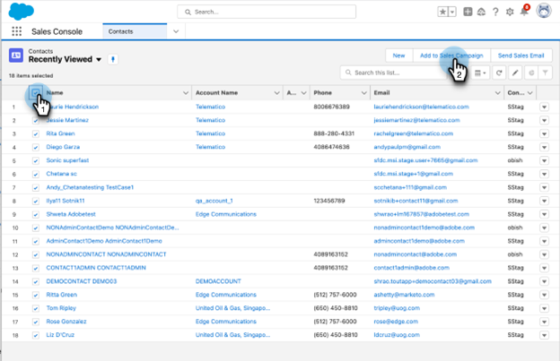

# 在Salesforce中使用批量添加到Sales Campaign {#using-bulk-add-to-sales-campaign-in-salesforce}

了解如何在Salesforce中批量添加到Sales Campaign，以帮助使用Sales Actions扩展出站通信。

>[!NOTE]
>
>Salesforce强制限制一次只能选择200条记录。

>[!PREREQUISITES]
>
>确保您已安装 [最新的Sales Insight包](/help/marketo/product-docs/marketo-sales-insight/msi-for-salesforce/upgrading/upgrading-your-msi-package.md){target="_blank"} to your Salesforce instance and have configured the [Action buttons](/help/marketo/product-docs/marketo-sales-insight/actions/crm/salesforce-package-configuration/add-action-buttons-to-salesforce-list-view.md){target="_blank"} Salesforce中的联系人和潜在客户列表视图。

## 在Salesforce Lightning中批量添加到Sales Campaign {#bulk-add-to-sales-campaign-in-salesforce-lightning}

1. 在Salesforce中，通过单击 **潜在客户/联系人** 选项卡。

   

1. 在 **视图** 从下拉列表中，选择要通过电子邮件发送的潜在客户/联系人视图。

   >[!TIP]
   >
   >您可以创建新视图，方法是单击右侧的齿轮图标并选择 **新**. 在为该视图指定新名称并保存它后，您可以单击右侧的过滤器图标，以帮助向下过滤到要通过电子邮件发送的潜在客户/联系人集。

1. 选择所需的潜在客户或联系人列表，然后单击 **添加到促销活动** 按钮。

   

1. 您将导航到Actions Sales Campaign模式窗口，并显示您已添加的收件人。

1. 进行任何删除人员或组所需的编辑，然后单击 **下一个**.

   

1. 从“类别”下拉列表中选择要使用的销售促销活动类别。

1. 选择要将选定人员添加到的销售活动，然后单击 **下一个**.

   

1. 根据营销活动中的第一步，您可能会看到不同的选项。 如果您的第一步是发送电子邮件，则可以选择编辑每个收件人的电子邮件，如下所示。 完成后，单击 **下一个**.

   

1. 同样，如果您的第一步是发送电子邮件，并且您将其配置为允许您选择何时启动促销活动，则您将可以选择执行以下操作 **立即开始** 或 **计划新的开始时间**. 完成后，单击 **开始**.

   

单击“开始”后，您将看到一个确认屏幕，让您知道已添加多少用户。

## 在Salesforce Classic中批量添加到Sales Campaign {#bulk-add-to-sales-campaign-in-salesforce-classic}

1. 在Salesforce中，单击 **潜在客户/联系人** 选项卡。

1. 在“视图”下拉列表中，选择要通过电子邮件发送的潜在客户/联系人所需视图，然后单击 **开始**.

   

   >[!TIP]
   >
   >您可以单击“创建新视图”并配置可用过滤器来缩小要向其发送电子邮件的收件人列表，从而创建新视图。

1. 选择所需的潜在客户或联系人列表，然后单击 **添加到促销活动** 按钮。

1. 您将导航到Actions Sales Campaign模式窗口，并显示您选择添加的人员。

1. 进行任何删除人员或组所需的编辑，然后单击 **下一个**.

   

1. 从中选择要使用的销售活动类别 **类别** 下拉菜单。

1. 选择要将选定人员添加到的销售活动，然后单击 **下一个**.

   

1. 根据营销活动中的第一步，您可能会看到不同的选项。 如果您的第一步是发送电子邮件，则可以选择编辑每个收件人的电子邮件，如下所示。 完成后，单击 **下一个**.

   

1. 同样，如果您的第一步是发送电子邮件，并且您将其配置为允许您选择何时启动促销活动，则您将可以选择执行以下操作 **立即开始** 或 **计划新的开始时间**. 完成后，单击 **开始**.

   

单击“开始”后，您将看到一个确认屏幕，让您知道已添加多少用户。

