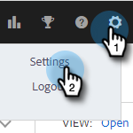

# 断开[!DNL Salesforce]与[!DNL Sales Insight Actions]的连接 {#disconnect-salesforce-from-sales-insight-actions}

有时您可能需要断开[!DNL Salesforce]帐户与[!DNL Sales Insight Actions]帐户的连接。 操作方法如下：

## 如何以管理员身份断开与[!UICONTROL Salesforce]的连接 {#how-to-disconnect-from-salesforce-as-an-admin}

1. 在[!DNL Sales Insight Actions]中，单击右上角的齿轮图标，然后选择&#x200B;**[!UICONTROL Settings]**。

   

1. 在[!UICONTROL Admin Settings]下，单击&#x200B;**[!UICONTROL Salesforce]**。

   

1. 在[!UICONTROL Connections & Customizations]选项卡中，单击&#x200B;**[!UICONTROL Disconnect]**。

   

## 如何以非管理员身份断开与[!DNL Salesforce]的连接 {#how-to-disconnect-from-salesforce-as-a-non-admin}

1. 在[!DNL Sales Insight Actions]中，单击右上角的齿轮图标，然后选择&#x200B;**[!UICONTROL Settings]**。

   

1. 在[!UICONTROL My Account]下，选择&#x200B;**[!UICONTROL Salesforce]**。

PICC

1. 在[!UICONTROL Connections & Customizations]选项卡中，单击&#x200B;**[!UICONTROL Disconnect]**。

PICC
