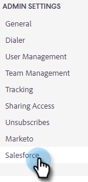

# 从Sales Insight操作中断开Salesforce的连接 {#disconnect-salesforce-from-sales-insight-actions}

有时，您可能需要将Salesforce帐户与Sales Insight Actions帐户断开连接。 这是方法。

## 如何作为管理员从Salesforce断开连接 {#how-to-disconnect-from-salesforce-as-an-admin}

1. 在Sales Insight Actions中，单击右上角的齿轮图标，然后选择 **设置**.

   

1. 在“管理员设置”下，单击 **Salesforce**.

   

1. 在连接和自定义选项卡中，单击 **断开连接**.

   

## 如何作为非管理员从Salesforce断开连接 {#how-to-disconnect-from-salesforce-as-a-non-admin}

1. 在Sales Insight Actions中，单击右上角的齿轮图标，然后选择 **设置**.

   

1. 在“我的帐户”下，选择 **Salesforce**.

PICC

1. 在连接和自定义选项卡中，单击 **断开连接**.

PICC
