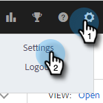
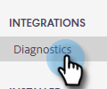

# Salesforce诊断 {#salesforce-diagnostics}

我们的Salesforce集成的一部分包括Web应用程序中的Salesforce诊断页面。 此页从失败的Salesforce数据记录中捕获错误。 错误虽然有用，但并不总是可读。 因此，我们将整理一张帮助解释错误消息的备忘录。

## 访问诊断 {#access-diagnostics}

1. 单击齿轮图标，然后选择 **设置**.

   

1. 在“集成”下，单击 **诊断**.

   

## 错误备忘单 {#error-cheat-sheet}

**错误：** API_CURRENTLY_DISABLED\
**类别：** 访问/验证\
**消息：** 此用户已禁用API\
**当前发生的情况：** 用户没有API访问权限\
**疑难解答步骤：** Salesforce管理员需要授予用户API访问权限。

**错误：** AUTHENTICATION_FAILURE\
**类别：** 身份验证\
**消息：** invalid_grant:身份验证失败\
**当前发生的情况：** 身份验证失败\
**疑难解答步骤：** 断开与Salesforce的连接，然后重新连接。

**错误：** CANNOT_INSERT_UPDATE_ACTIVATE_ENTITY\
**类别：** 访问/验证\
**消息：** {&quot;errorCode&quot;:&quot;INVALID_SESSION_ID&quot;,&quot;message&quot;:&quot;session expired or invalid&quot;}\
**当前发生的情况：**

1 — 触发器代码导致更新失败。\
2 — 用户对给定对象没有对象级写入权限。

**疑难解答步骤：**

1 — 查看失败的触发器。\
2 — 为对象授予用户写入权限，或者禁用尝试写入对象的功能。

**错误：** CANNOT_UPDATE_CONVERTED_LEAD\
**类别：** 其他\
**消息：** 无法引用已转换的潜在客户\
**当前发生的情况：** 我们正在尝试在联系人和潜在客户的最近活动日志记录期间登录到已转换的潜在客户。 还看到几个用于推销的。\
**疑难解答步骤：** 如有此情况，请向我们的 [支持团队](https://nation.marketo.com/t5/Support/ct-p/Support).

**错误：** ENTITY_IS_LOCKED\
**类别：** 访问/验证\
**消息：** 实体已锁定进行编辑\
**当前发生的情况：** 该记录处于批准流程中，在获得批准或被批准者拒绝之前，该记录会被锁定在任何其他编辑中。\
**疑难解答步骤：** 请参阅上文。

**错误：** EXPIRED_ACCESS
**类别：** 身份验证
**消息：** invalid_grant:过期的访问/刷新令牌
**当前发生的情况：** 访问或刷新令牌已过期。 令牌的过期时间基于 [Salesforce中的会话设置](https://salesforce.stackexchange.com/questions/10759/invalid-grant-expired-access-refresh-token-error-when-authenticating-access-via).
**疑难解答步骤：** 您需要重新验证身份。 断开Salesforce连接并重新连接。

**错误：** FAILED_WRITE\
**类别：** 间歇\
**消息：** 已达到文件结尾\
**当前发生的情况：** Salesforce出现性能问题，可能是因为客户端的触发器未达到最佳。\
**疑难解答步骤：** 重试逻辑应处理此问题。 如果仍无法正常工作，请与Salesforce管理员合作，对有问题的触发器进行故障诊断。

**错误：** FIELD_CUSTOM_VALIDATION_EXCEPTION
**类别：** 访问/验证
**消息：** 因客户而异。
**当前发生的情况：** 未通过对象的自定义验证规则。
**疑难解答步骤：** 检查导致此错误的自定义验证规则。 由于这是自定义规则，因此必须一次性处理错误。

**错误：** FIELD_FILTER_VALIDATION_EXCEPTION\
**类别：** 访问/验证\
**消息：** 值不存在或与筛选条件不匹配\
**当前发生的情况：** 更新时，Salesforce中的现有错误数据将被强制执行。\
**疑难解答步骤：** 请参阅上文。

**错误：** FIELD_INTEGRITY_EXCEPTION\
**类别：** 访问/验证\
**消息：** 现有国家/地区不承认字段的州值：州/省代码\
**当前发生的情况：** 更新时，Salesforce中的现有错误数据将被强制执行。\
**疑难解答步骤：** 请参阅上文。

**错误：** INACTIVE_ORGANIZATION\
**类别：** 身份验证\
**消息：** invalid_grant:非活动组织\
**当前发生的情况：** 您的Salesforce组织不再处于活动状态。
**疑难解答步骤：** 断开连接，然后重新连接到Salesforce。

**错误：** INACTIVE_USER
**类别：** 身份验证
**消息：** invalid_grant:非活动用户
**当前发生的情况：** Salesforce用户不再处于活动状态
**疑难解答步骤：** 断开连接，然后重新连接到Salesforce。

**错误：** INSERT_UPDATE_DELETE_NOT_ALLOWED_DURING_MAINTENANCE\
**类别：** 间歇\
**消息：** （无其他消息）\
**当前发生的情况：** Salesforce实例处于维护模式。\
**疑难解答步骤：** 等待系统维护完成，然后重试记录。

**错误：** INDIFIC_ACCESS_ON_CROSS_REFERENCE_ENTITY
**类别：** 访问/验证
**消息：** 对象id的访问权限不足
**当前发生的情况：** 无权访问任务的父记录。
**疑难解答步骤：** 请参阅上文。

**错误：** INDEFIC_ACCESS_OR_READONLY\
**类别：** 访问/验证
**消息：** 对象id的访问权限不足
**当前发生的情况：** 最近的活动日志记录无法编辑特定记录，因为用户没有写入权限。\
**疑难解答步骤：** 在Salesforce中授予用户访问权限，或为该用户禁用该对象的“最新活动”日志记录。

**错误：** INVALID_FIELD\
**类别：** 间歇\
**消息：** Net::ReadTimeout\
**当前发生的情况：** 请求超时。 这可能是交易过于缓慢的结果。\
**疑难解答步骤：** 检查潜在引发延迟问题的因素的现有自定义设置和/或禁用一个或多个对象的“最新活动”日志记录以减少负载。

**错误：** INVALID_FIELD_FOR_INSERT_UPDATE\
**类别：** 访问/验证\
**消息：** 无法创建/更新字段：ToutApp__Tout_Last_Repleded__c。请检查此字段的安全设置。
**当前发生的情况：** 用户无权写入执行“最近活动”日志记录事务处理所需的“销售分析操作”自定义字段。 团队可能已安装包，但尚未为用户启用正确的字段。\
**疑难解答步骤：** Salesforce管理员需要授予对自定义字段的访问权限，或关闭“最新活动”日志记录。

**错误：** INVALID_GRANT\
**类别：** 身份验证\
**消息：** invalid_grant:受限制\
**当前发生的情况：** 我们正在尝试访问您的Salesforce，但您已设置IP限制，阻止我们访问。\
**疑难解答步骤：** 您的Salesforce管理员将需要允许列表我们的IP。 用户应联系支持团队以获取IP地址。

**错误：** INVALID_TYPE\
**类别：** 访问/验证\
**消息：** CreatedDate（从任务中选择ID），从潜在客户中， Email=&#39;emailid&#39;^ERROR at Row:1:不支持Column:53sObject类型“Lead”。 如果您尝试使用自定义对象，请确保在实体名称后面附加“__c”。 请引用您的WSDL或描述调用以获取相应的名称
**当前发生的情况：** 我们尝试从Salesforce中查询用户无权访问的对象类型。 这很可能与用户无权访问潜在客户对象有关。\
**疑难解答步骤：** 在Salesforce中授予对潜在客户对象的读取和更新访问权限，或关闭电子邮件日志记录和最近活动日志记录以创建潜在客户记录。

**错误：** QUERY_TIMEOUT\
**类别：** 间歇\
**消息：** 您的查询请求运行时间过长\
**当前发生的情况：** 请参阅上文。\
**疑难解答步骤：** 重试逻辑应处理此问题。 如果仍无法正常工作，请与Salesforce管理员合作，对有问题的触发器进行故障诊断。

**错误：** REQUEST_LIMIT_EXCEEDED\
**类别：** 间歇\
**消息：**
1 — 超出ConcurrentPerOrgLongTxn限制\
2 — 超出总请求数限制\
3 — 并发请求\
**当前发生的情况：**
1 — 超出并发请求限制，可能是由于触发器代码效率低下所致。\
2 — 集成过多会将组织置于24小时滚动窗口之外。\
**疑难解答步骤：**
1 — 查看受影响对象的现有触发器。 可能禁用一个或多个对象的汇总日志记录。\
2 — 从Salesforce购买更多API调用。 可能禁用一个或多个对象的汇总日志记录。

**错误：** REQUIRED_FIELD_MISSING\
**类别：** 访问/验证\
**消息：** 缺少必填字段： `[Amount_Committed_Private_Capital__c]`
**当前发生的情况：** 这通常适用于最近的活动日志记录。 自定义字段设置为必填字段，但其中具有空值。 如果创建的记录具有自定义字段的空值，且随后设置为必填，则可能会发生这种情况。 在尝试更新记录时，即使未触及自定义字段，也会强制执行要求。\
**疑难解答步骤：** 手动更新缺少字段的值。 然后，您可以从“销售分析操作”中重试该消息。

**错误：** SERVER_UNAVAILABLE\
**类别：** 间歇\
**消息：** 服务器太忙\
**当前发生的情况：** 由于客户触发的次优触发器，Salesforce出现性能问题\
**疑难解答步骤：** 重试逻辑应处理此问题。 如果仍无法正常工作，请与Salesforce管理员合作，以故障诊断有问题的触发器。

**错误：** TXN_SECURITY_NO_ACCESS\
**类别：** 访问/验证\
**消息：** 由于您组织中的安全策略，不允许您请求的操作。 请联系您的管理员。
**当前发生的情况：** 已设置某种安全限制 — 请参阅https://developer.salesforce.com/forums/?id=&quot;记录ID&quot;\
**疑难解答步骤：** 与您的Salesforce管理员联系，了解具体限制是什么。

**错误：** UNABLE_TO_LOCK_ROW\
**类别：** 间歇\
**消息：** 无法获取对此记录或1条记录的独占访问：&quot;记录ID&quot;\
**当前发生的情况：** 可能存在导致多次尝试访问同一记录的触发器，对于群组电子邮件，可能是如此。\
**疑难解答步骤：** 重试逻辑应处理此问题。 如果仍无法正常工作，请与Salesforce管理员合作，对有问题的触发器进行故障诊断。

**错误：** UNKNOWN_EXCEPTION
**类别：** 其他\
**消息：** 发生未知异常\
**当前发生的情况：** Salesforce中出现未处理的异常。\
**疑难解答步骤：** 使用Salesforce案例，并复制错误消息中的数值。 这是Salesforce代码无法正确处理错误。
