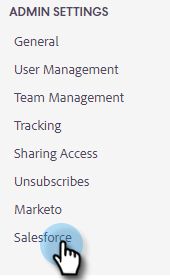

# 将销售活动同步到 Salesforce {#sync-sales-activities-to-salesforce}

您可以配置“Salesforce同步设置”操作，以将电子邮件和调用活动记录到Salesforce。 这样可以让处理CRM的团队更清晰地了解情况，并且允许经理使用这些活动构建自定义Salesforce报表来跟踪团队表现。

## 通过API将电子邮件活动记录到Salesforce {#logging-email-activity-to-salesforce-via-api}

此功能要求您使用Salesforce的Enterprise/Unlimited版本或Professional版本（如果您已通过Web服务API购买集成）。

>[!PREREQUISITES]
>
>Salesforce和Sales Insight Actions必须相连。

1. 在Sales Insight操作中，单击齿轮图标并选择&#x200B;**设置**。

   

1. 在“管理员设置”（如果您不是管理员，则单击“我的帐户”）下，单击&#x200B;**Salesforce**。

   

1. 单击&#x200B;**同步设置**&#x200B;选项卡。

   

1. 单击“Log Email Activity to Salesforce（将电子邮件活动记录到）”旁边的箭头。

   

1. 单击&#x200B;**Salesforce API**&#x200B;选项卡。 在此信息卡中，您可以设置用于将信息记录到Salesforce的首选项。 完成后单击&#x200B;**保存**。

   

## 通过电子邮件将电子邮件活动记录到Salesforce到Salesforce （密送） {#logging-email-activity-to-salesforce-via-email-to-salesforce-bcc}

激活“发送电子邮件至Salesforce （密送）”后，您将收到销售电子邮件的密送，并且您的电子邮件将记录为有关机会、潜在客户和联系人的活动。

>[!PREREQUISITES]
>
>Salesforce和Sales Insight Actions必须相连。

**通过电子邮件在Salesforce中记录电子邮件（密件抄送）**

1. 在Marketo Sales中，单击齿轮图标并选择&#x200B;**设置**。

   

1. 在“管理员设置”（如果您不是管理员，则单击“我的帐户”）下，单击&#x200B;**Salesforce**。

   

1. 单击&#x200B;**同步设置**&#x200B;选项卡。

   

1. 单击&#x200B;**发送到Salesforce （密件抄送）的电子邮件**&#x200B;选项卡，然后单击&#x200B;**激活**。

   

如果由于某种原因导致您发送到Salesforce的电子邮件地址无法提取，请按照以下步骤在您的Salesforce帐户中激活密件抄送功能：

1. 登录到您的Salesforce实例。
1. 在右上角找到您的用户名，然后选择下拉栏。
1. 选择&#x200B;**我的设置**。
1. 选择&#x200B;**电子邮件**。
1. 选择&#x200B;**我的电子邮件至Salesforce**。
1. 在此页面上，您将看到一个标记为“发送到Salesforce地址的电子邮件”的字段。 如果旁边未填充任何内容，请向下滚动到“我的可接受电子邮件地址”。
1. 输入您希望密件抄送的电子邮件地址。
1. 单击&#x200B;**保存更改**。

**在“我的设置”中找不到我发送到Salesforce的电子邮件**

如果在“设置”下未看到“我发送到Salesforce的电子邮件”，则可能是因为管理员未启用它。 如果您的团队不熟悉Salesforce，或者您的团队从未使用Salesforce提供的密件抄送地址，则可能会发生这种情况。

>[!NOTE]
>
>您需要管理员权限才能设置此项。

1. 单击&#x200B;**设置**。
1. 单击&#x200B;**电子邮件管理**。
1. 单击&#x200B;**通过电子邮件发送到Salesforce**。
1. 单击&#x200B;**编辑**。
1. 选中“活动”旁边的框。
1. 单击&#x200B;**保存**。

## 将Sales Insight操作任务/提醒同步到Salesforce任务 {#sync-sales-insight-actions-tasks-reminders-to-salesforce-tasks}

1. 在Sales Insight操作中，单击齿轮图标并选择&#x200B;**设置**。

   

1. 在“管理员设置”（如果您不是管理员，则单击“我的帐户”）下，单击&#x200B;**Salesforce**。

   

1. 单击&#x200B;**同步设置**&#x200B;选项卡。

   

1. 单击“将Marketo销售任务/提醒同步到Salesforce任务”旁边的箭头。

   

1. 选择所需的选项(默认情况下选中“不同步到Salesforce任务”)。

   

## 首次将Sales Insight操作任务与Salesforce同步 {#syncing-sales-insight-ations-tasks-with-salesforce-for-the-first-time}

当您首次打开Sales Insight Actions与Salesforce任务之间的同步时，我们会导入您的Salesforce任务。 我们不会将您在Sales Insight Actions中拥有的任何当前任务转移到Salesforce。 为了减少杂乱和重复情况，从Sales Insight操作同步到Salesforce中的唯一任务是在您将Sales Insight操作与SFDC同步之后创建的任务。

以下是同步Sales Insight Actions和SFDC任务时所发生的情况：

* 在同步的任务上单击“保存”后，它们就会开始进行同步。 这最初将需要一些时间。

* 过去24小时内已更新或创建的任何提醒都将从SFDC拉入Sales Insight Actions。 同步基于到期日期，所有这些任务将在后端进行同步，但在命令中心，您只能看到今天和明天到期的任务。

* 如果以前启用了同步，并且您删除了SFDC中的任何任务，则过去15天内删除的任何任务都将从命令中心删除。

* 我们将不断在Sales Insight Actions与SFDC之间同步任务，只要同步已启用即可。

* 初次同步后，您在Sales Insight Actions中创建、编辑、完成或删除的任何任务都将同步到Salesforce中的任务列表。 在Salesforce中创建、编辑、完成或删除的任何内容，都会在Sales Insight Actions中更新您的任务列表。

* 要打开此同步，只需选中Web应用程序中“设置”页面中的同步框。
