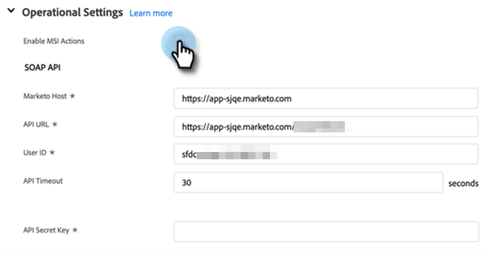

# [!DNL Sales Insight Actions]中的[!DNL Salesforce]配置 {#sales-insight-actions-configuration-in-salesforce}

>[!PREREQUISITES]
>
>* 在您的[实例中](/help/marketo/product-docs/marketo-sales-insight/msi-for-salesforce/installation/install-marketo-sales-insight-package-in-salesforce-appexchange.md)安装[或](/help/marketo/product-docs/marketo-sales-insight/msi-for-salesforce/upgrading/upgrading-your-msi-package.md)升级[!DNL Salesforce]销售Insight包
>* [在 [!DNL Salesforce] Enterprise/Unlimited](/help/marketo/product-docs/marketo-sales-insight/msi-for-salesforce/configuration/configure-marketo-sales-insight-in-salesforce-enterprise-unlimited.md)中配置Marketo Sales Insight

## 在[!DNL Salesforce]中添加新的远程站点 {#add-new-remote-site-in-salesforce}

1. 在[!DNL Salesforce]中，单击&#x200B;**[!UICONTROL Setup]**。

   

1. 搜索“[!UICONTROL remote site]”并选择&#x200B;**[!UICONTROL Remote Site Settings]**。
   

1. 单击 **[!UICONTROL New Remote Site]**。

   

1. 输入远程站点名称（可以类似于“MarketoSalesInsight1”）。 输入远程站点URL `https://ims-na1.adobelogin.com`并单击&#x200B;**[!UICONTROL Save]**。

   

1. 再次单击&#x200B;**[!UICONTROL New Remote Site]**。

   

1. 输入远程站点名称（可以类似于“MarketoSalesInsight2”）。 输入远程站点URL `https://mkto-sales-connect.adobe.io`并单击&#x200B;**[!UICONTROL Save]**。

## 在CRM中启用[!DNL Sales Insight Actions] {#enabling-sales-insight-actions-across-the-crm}

1. 在[!DNL Salesforce]中，单击&#x200B;**[!UICONTROL Marketo Sales Insight Config]**&#x200B;选项卡。

   

   >[!NOTE]
   >
   >如果您在顶部栏中未看到“[!UICONTROL Marketo Sales Insight Config]”，请单击&#x200B;**+**&#x200B;符号并在“所有选项卡”下找到它。

1. 选中&#x200B;**[!UICONTROL Enable MSI Actions]**&#x200B;复选框。

   

1. 输入[!UICONTROL API Secret Key]。

   

   >[!NOTE]
   >
   >如果您没有可用的[!UICONTROL API Secrey Key]，可以按照[本文](/help/marketo/product-docs/marketo-sales-insight/msi-for-salesforce/configuration/configure-marketo-sales-insight-in-salesforce-enterprise-unlimited.md)中的步骤找到它。

1. 完成后单击&#x200B;**[!UICONTROL Save]**。

这将自动启用功能概述文章中概述的所有MSI操作功能。

>[!NOTE]
>
>只需取消选中“启用MSI操作”复选框，即可禁用所有MSI操作功能。

## MSI操作管理 {#msi-actions-governance}

1. 您可以在即将到来的部分中禁用Sales Campaigns和/或Task选项卡。 这将适用于潜在客户、联系人、客户和机会面板。

   

1. 您可以通过取消选中[!UICONTROL Actions settings]下的相应功能来禁用MSI操作。

   

>[!NOTE]
>
>治理设置适用于所有MSI用户。
