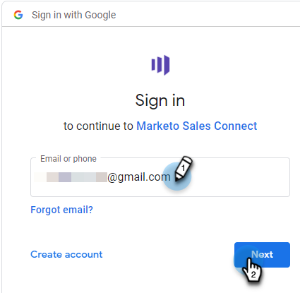
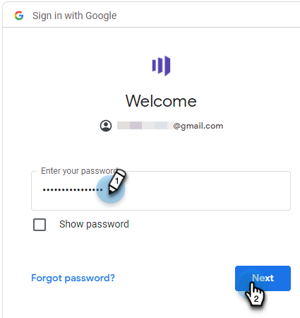

# 连接到 Gmail {#connect-to-gmail}

连接到Gmail意味着您将获得回复跟踪、访问Gmail投放渠道、在Gmail中计划电子邮件以及发送合规性的功能。

>[!CAUTION]
>
>如果您[在Gmail帐户中使用筛选器](https://support.google.com/mail/answer/6579?hl=en#zippy=%2Ccreate-a-filter%2Cedit-or-delete-filters){target="_blank"}或规则来自动将电子邮件标记为已读，这可能会导致回复跟踪问题。 我们建议禁用在通过Gmail使用回复跟踪时将电子邮件自动标记为已读的任何规则。

1. 在Marketo Sales中，单击齿轮图标并选择&#x200B;**设置**。

   

1. 在“我的帐户”下，选择&#x200B;**电子邮件设置**。

   

1. 单击&#x200B;**电子邮件连接**&#x200B;选项卡。

   

1. 单击&#x200B;**开始**。

   

1. 选择&#x200B;**我使用Gmail发送电子邮件**，然后单击&#x200B;**下一步**。

   

1. 单击&#x200B;**确定**。

   

1. 如果您已经登录Gmail，请选择您要连接的帐户。 如果没有，请输入您的Gmail地址，然后单击&#x200B;**下一步**。 在本例中，我们尚未登录。

   

1. 输入密码，然后单击&#x200B;**下一步**。

   

1. 单击&#x200B;**允许**。

   

   您可以使用此连接来跟踪电子邮件，也可以将其用作投放渠道。

>[!NOTE]
>
>Gmail强制执行其自身的发送限制。 [在此了解详情](/help/marketo/product-docs/marketo-sales-connect/email/email-delivery/email-connection-throttling.md#email-provider-limits)。
