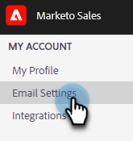

# 连接到Gmail {#connect-to-gmail}

连接到Gmail意味着您将获得回复跟踪、访问Gmail投放渠道、在Gmail中计划电子邮件以及发送合规性的功能。

>[!CAUTION]
>
>如果您是 [使用过滤器](https://support.google.com/mail/answer/6579?hl=en#zippy=%2Ccreate-a-filter%2Cedit-or-delete-filters){target="_blank"} 或Gmail帐户中用于将电子邮件自动标记为已读的规则，这可能会导致回复跟踪问题。 我们建议禁用在通过Gmail使用回复跟踪时将电子邮件自动标记为已读的任何规则。

1. 在Marketo Sales中，单击齿轮图标并选择 **设置**.

   

1. 在我的帐户下，选择 **电子邮件设置**.

   

1. 单击 **电子邮件连接** 选项卡。

   

1. 单击 **开始使用**.

   

1. 选择 **我使用Gmail发送电子邮件** 并单击 **下一个**.

   

1. 单击 **确定**.

   

1. 如果您已登录Gmail，请选择您要连接的帐户。 如果没有，请输入您的Gmail地址，然后单击 **下一个**. 在本例中，我们尚未登录。

   

1. 输入密码，然后单击 **下一个**.

   

1. 单击 **允许**.

   

   您可以使用此连接来跟踪电子邮件，也可以将其用作投放渠道。

>[!NOTE]
>
>Gmail强制执行其自身的发送限制。 [在此处了解详情](/help/marketo/product-docs/marketo-sales-connect/email/email-delivery/email-connection-throttling.md#email-provider-limits).
