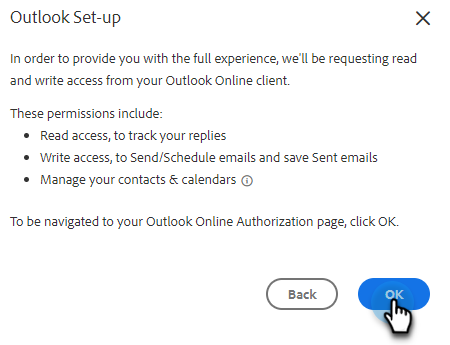

# 连接到Outlook {#connect-to-outlook}

了解如何将Sales Insight Actions帐户与Outlook连接。

>[!NOTE]
>
>每个用户都需要从其Marketo Sales帐户连接到Outlook。

## 正在连接到Outlook Online {#connecting-to-outlook-online}

连接到Outlook意味着您将获得回复跟踪、对Outlook投放渠道的访问权限、在Outlook中计划电子邮件的能力以及发送合规性。

1. 在Marketo Sales中，单击齿轮图标并选择&#x200B;**设置**。

   

1. 在“我的帐户”下，选择&#x200B;**电子邮件设置**。

   

1. 单击&#x200B;**电子邮件连接**&#x200B;选项卡。

   

1. 单击&#x200B;**开始**。

   

1. 选择&#x200B;**我使用Outlook发送电子邮件**，然后单击&#x200B;**下一步**。

   

1. 选择您正在使用的Outlook版本，然后单击&#x200B;**下一步**。 在本例中，我们选择Outlook Online。

   

   <table> 
    <tbody>
     <tr>
      <td><strong>Outlook联机</strong></td> 
      <td>也称为Exchange Online</td> 
     </tr>
     <tr>
      <td><strong>Exchange内部部署</strong></td> 
      <td>包括Exchange 2013和2016</td> 
     </tr>
    </tbody>
   </table>

   >[!NOTE]
   >
   >Marketo目前不支持Exchange混合帐户。

1. 单击&#x200B;**确定**。

   

1. 如果未登录Outlook，请输入登录信息，然后单击&#x200B;**下一步**。 如果是，请选择要连接的帐户，然后单击&#x200B;**下一步**。 在本例中，我们已登录。

   

1. 单击&#x200B;**接受**。

   

   您可以使用此连接来跟踪电子邮件，也可以将其用作投放渠道。

   >[!NOTE]
   >
   >Outlook Online (Office365)强制执行其自身的发送限制。 [在此了解详情](/help/marketo/product-docs/marketo-sales-connect/email/email-delivery/email-connection-throttling.md#email-provider-limits)。

## 连接到Exchange On-Premise {#connecting-to-exchange-on-premise}

连接到Exchange内部部署意味着您将获得回复跟踪、对Outlook投放渠道的访问权限、在Outlook中计划电子邮件的能力以及发送合规性。

1. 在Marketo Sales中，单击齿轮图标并选择&#x200B;**设置**。

   

1. 在“我的帐户”下，选择&#x200B;**电子邮件设置**。

   

1. 单击&#x200B;**电子邮件连接**&#x200B;选项卡。

   

1. 单击&#x200B;**开始**。

   

1. 选择&#x200B;**我使用Outlook发送电子邮件**，然后单击&#x200B;**下一步**。

   

1. 选择您正在使用的Outlook版本，然后单击&#x200B;**下一步**。 在此示例中，我们选择了Exchange On-premise。

   

   <table> 
    <tbody>
     <tr>
      <td><strong>Outlook联机</strong></td> 
      <td>也称为Exchange Online</td> 
     </tr>
     <tr>
      <td><strong>Exchange内部部署</strong></td> 
      <td>包括Exchange 2013和2016</td> 
     </tr>
    </tbody>
   </table>

1. 输入您的凭据，然后单击&#x200B;**连接**。

   

   >[!NOTE]
   >
   >如果在Exchange版本下拉列表中关闭自动发现，则需要向IT部门询问Exchange URL。

   您可以使用此连接来跟踪电子邮件，也可以将其用作投放渠道。

   >[!NOTE]
   >
   >在使用Exchange内部部署时，您的IT团队将建立您的电子邮件发送限制。

## 正在获取连接到Outlook Online的权限 {#getting-permission-to-connect-to-outlook-online}

您可能需要与IT团队合作，以获得允许Marketo Sales连接到您的Outlook Online帐户(Microsoft 365)的权限。

>[!NOTE]
>
>告知管理Microsoft 365帐户的IT团队，需要访问的应用程序是“Marketo Sales Connect”。

根据您的IT团队的偏好和当前配置，最好向他们咨询如何授予访问权限。 下面是一些有助于指导对话的文章。

* 全局同意：适用于Microsoft 365管理员的[集成应用和Azure AD](https://learn.microsoft.com/en-us/microsoft-365/enterprise/integrated-apps-and-azure-ads?view=o365-worldwide){target="_blank"}
* 用户同意： [配置用户如何同意应用程序](https://learn.microsoft.com/en-us/azure/active-directory/manage-apps/configure-user-consent?tabs=azure-portal&amp;pivots=portal){target="_blank"}
* 管理员同意： [配置管理员同意工作流](https://learn.microsoft.com/en-us/microsoft-365/admin/misc/user-consent?source=recommendations&amp;view=o365-worldwide){target="_blank"}
* 打开或关闭用户同意： [在Microsoft 365中管理用户对应用的同意](https://learn.microsoft.com/en-us/microsoft-365/admin/misc/user-consent?source=recommendations&amp;view=o365-worldwide){target="_blank"}
* 使用Microsoft Defender进行管理： [管理OAuth应用程序](https://learn.microsoft.com/en-us/defender-cloud-apps/manage-app-permissions){target="_blank"}
