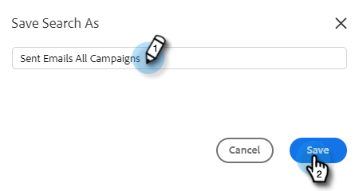

# 高级搜索概述 {#advanced-search-overview}

通过利用高级搜索来定位已查看、点击或回复电子邮件的潜在客户，您可以创建最活跃的潜在客户的目标列表。

## 如何访问高级搜索 {#how-to-access-advanced-search}

1. 在Web应用程序中，单击 **指挥中心**.

   

1. 单击 **电子邮件**.

   

1. 选择适用的选项卡。

   

1. 单击“高级搜索”。

   

## 过滤器 {#filters}

**日期**

选择搜索的日期范围。 预设日期会根据您选择的电子邮件状态（“已发送”、“未送达”、“待定”）而更新。

**谁**

在Who部分中按电子邮件收件人/发件人筛选。

<table>
 <tr>
  <td><strong>下拉列表</strong></td>
  <td><strong>描述</strong></td>
 </tr>
 <tr>
  <td><strong>查看方式</strong></td>
  <td>在Sales Connect实例中按特定发件人筛选（此选项仅对管理员可用）。</td>
 </tr>
 <tr>
  <td><strong>按组</strong></td>
  <td>按特定收件人组筛选电子邮件。</td>
 </tr>
 <tr>
  <td><strong>按人员</strong></td>
  <td>按特定收件人筛选。</td>
 </tr>
</table>

**时间**

按创建日期、交付日期、失败日期或计划日期选择。 可用选项会根据您选择的电子邮件状态（“已发送”、“未送达”、“待定”）而发生更改。

**营销活动**

按促销活动参与率过滤电子邮件。

**状态**

有三个电子邮件状态可供选择。 类型/活动选项会根据选定的状态而更改。

_**状态：已发送**_

按您已发送的电子邮件活动筛选。 您可以选择查看/无查看、点击/无点击和/或回复/无回复。

_**状态：待定**_

按所有待处理电子邮件进行筛选。

<table>
 <tr>
  <td><strong>状态</strong></td>
  <td><strong>描述</strong></td>
 </tr>
 <tr>
  <td><strong>已安排</strong></td>
  <td>从撰写窗口（Salesforce或Web应用程序）、电子邮件插件或营销活动计划的电子邮件。</td>
 </tr>
 <tr>
  <td><strong>草稿</strong></td>
  <td>当前处于草稿状态的电子邮件。 电子邮件需要主题行和收件人才能另存为草稿。</td>
 </tr>
 <tr>
  <td><strong>进行中</strong></td>
  <td>正在发送的电子邮件。 电子邮件不应保持此状态超过几秒钟。</td>
 </tr>
</table>

_**状态：未送达**_

按从未送达的电子邮件筛选条件。

<table>
 <tr>
  <td><strong>状态</strong></td>
  <td><strong>描述</strong></td>
 </tr>
 <tr>
  <td><strong>已失败</strong></td>
  <td>当电子邮件无法从Sales Connect发送时（常见原因包括：电子邮件被发送到未订阅/阻止的联系人，或者填充动态字段时出现问题）。</td>
 </tr>
 <tr>
  <td><strong>已退回</strong></td>
  <td>当电子邮件被收件人的服务器拒绝时，该电子邮件会被标记为已退回。 此处仅显示通过Sales Connect服务器发送的电子邮件。</td>
 </tr>
 <tr>
  <td><strong>垃圾邮件</strong></td>
  <td>收件人将电子邮件标记为垃圾邮件（非请求电子邮件的常用术语）的时间。 此处仅显示通过Sales Connect服务器发送的电子邮件。</td>
 </tr>
</table>

## 保存的搜索 {#saved-searches}

以下是如何创建保存的搜索。

1. 所有筛选器都就绪后，单击 **将筛选器另存为**.

   

1. 为您的搜索提供一个名称，然后单击 **保存**.

   

您保存的搜索将位于左侧边栏中。

