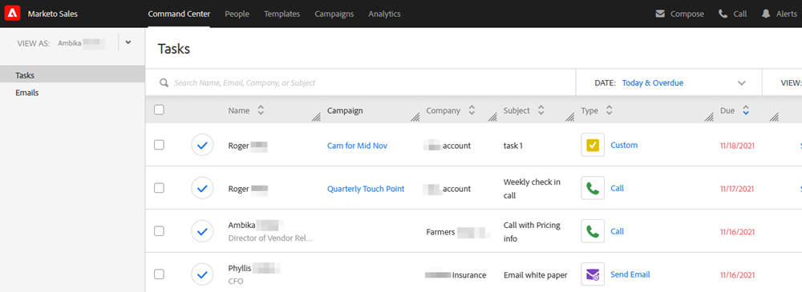

# 命令中心概述 {#command-center-overview}

[!UICONTROL Command Center]是一个单一、统一的视图，可帮助您确定下一步骤，同时确保不会有任何内容漏掉。

## 管理电子邮件 {#manage-emails}

在[!UICONTROL Command Center]的电子邮件部分，您可以管理所有电子邮件活动。 将其视为您的电子邮件发件箱，以审阅从[!DNL Sales Connect]发送的电子邮件。 管理您的计划电子邮件，查看谁一直在处理您的电子邮件，检查您的电子邮件是否传送有任何问题等等。

电子邮件部分为您提供所有电子邮件的概览，并通过主选项卡和子选项卡简化其组织，这些选项卡和子选项卡用作文件夹，其中电子邮件会根据其状态自动存储。

<table>
 <tr>
  <th>主要</th>
  <th>辅助</th>
  <th>描述</th>
 </tr>
 <tr>
  <th rowspan="2">[!UICONTROL Sent]</th>
  <td>[!UICONTROL Delivered]</td>
  <td>已发送给收件人的电子邮件。</td>
 </tr>
 <tr>
  <td>[!UICONTROL Archived]</td>
  <td>用户为了禁用电子邮件跟踪而存档的电子邮件。</td>
 </tr>
 <tr>
  <th rowspan="3">[!UICONTROL Pending]</th>
  <td>[!UICONTROL Scheduled]</td>
  <td>当前计划发出的电子邮件。 发送电子邮件后，该电子邮件将移至已投放文件夹。</td>
 </tr>
 <tr>
  <td>[!UICONTROL Draft]</td>
  <td>已另存为草稿的电子邮件。 
  <strong>注意</strong>：只有一封电子邮件可以另存为草稿。 批量电子邮件（选择和发送电子邮件及群电子邮件）将不会另存为草稿。</td>
 </tr>
 <tr>
  <td>[!UICONTROL In] 进度</td>
  <td>这是一种中间状态，当电子邮件处于发送动态时，便会进入该状态。 电子邮件只应正在进行一段时间。</td>
 </tr>
 <tr>
  <th rowspan="3">[!UICONTROL Undelivered]</th>
  <td>[!UICONTROL Failed]</td>
  <td>无法投放的电子邮件。
</td>
 </tr>
 <tr>
  <td>[!UICONTROL Bounced]</td>
  <td>已从收件人电子邮件服务器拒绝的电子邮件。 
  <strong>注意</strong>：仅当您是旧版ToutApp用户并且有权访问MSC服务器作为投放渠道时，才会检测到此情况。</td>
 </tr>
 <tr>
  <td>[!UICONTROL Spam]</td>
  <td>收件人手动标记为垃圾邮件的电子邮件。 
  <strong>注意</strong>：仅当您是旧版ToutApp用户并且有权访问MSC服务器作为投放渠道时，才会检测到此情况。</td>
 </tr>
</table>

## 管理任务 {#manage-tasks}

“任务”部分是一个用于管理和完成任务的一站式站点。 在这里，您可以无缝地管理您的任务，以提高工作效率并专注于最相关的项目。

## 参与的潜在客户跟进 {#follow-up-with-engaged-prospects}

一旦您开始通过撰写窗口或营销活动与潜在客户接洽，您就可以利用高级搜索功能开始重新定位参与度最高的潜在客户。

例如，如果您在MSC中向某个营销活动添加100个人，则您可能需要重新定位那些查看了您的电子邮件并单击了它，但未回复该电子邮件的人。 为此，您可以利用Campaign过滤器以及View和Click status Activity过滤器，以标识要重新定位的人员列表。

奖励：如果保存高级搜索，它将作为动态列表使用，并在收件人查看或单击您的电子邮件后添加符合参与条件的电子邮件。

>[!MORELIKETHIS]
>
>* 任务
>* 高级搜索概述
>* 使用“选择并发送”撰写批量电子邮件
