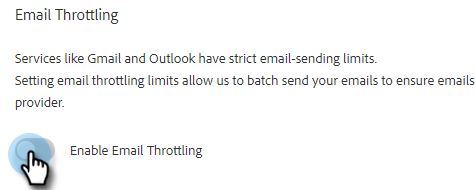

# 电子邮件连接限制 {#email-connection-throttling}

集成要通过Exchange或Gmail电子邮件提供商发送的Sales Connect帐户，可简化设置并优化电子邮件可投放性，以实现一对一的销售通信。 但是，为了保持系统健康和帐户安全，Gmail和Exchange强制执行电子邮件发送限制。 这些限制可由提供商自行决定增加或减少。

## 电子邮件连接限制（测试版） {#email-connection-throttling-beta}

>[!AVAILABILITY]
>
>此功能目前处于Beta测试阶段。 要加入，请联系Adobe客户团队（您的客户经理）。

电子邮件连接限制允许Sales Connect管理员在使用Gmail或Exchange作为投放渠道时配置电子邮件的发送速率，以便向投放渠道提供商传递电子邮件的速率不超过实施的限制。

当始终超过限制时，有时可能会被视为来自投放渠道提供商的可疑行为，从而导致电子邮件失败，有时甚至导致帐户被禁用。

**注释/突出显示**

* 用户连接到Gmail或Exchange后自动启用
* 如果要根据推荐增加或减少设置以满足您的需求，可以对其进行自定义
* 仅限制通过Gmail或Exchange发送的电子邮件，不会限制自定义投放渠道
* 电子邮件连接限制将单独为每个单独的用户发送电子邮件排队，因为每个用户与其电子邮件提供商都有自己的连接

**配置电子邮件连接限制设置**

1. 单击齿轮图标并选择 **设置**.

   

1. 在管理设置下，单击 **常规**.

   

1. 在右侧的电子邮件连接限制卡中，单击 **启用电子邮件限制** 滑块。

   

1. 在右侧的电子邮件连接限制卡中，输入将发送到电子邮件渠道提供商的所需电子邮件批次大小。

   

1. 设置发送每个批次前等待的时间。 在此示例中，我们每45秒选择25封电子邮件。

   

1. 单击 **保存**.

   

保存更改后，所有用户都将将其电子邮件分批发送到其连接的Gmail或Exchange帐户以进行交付。

## 电子邮件提供商限制 {#email-provider-limits}

**Outlook 365**

商业/企业

* 每天10,000
* 每分钟30次
* 每封电子邮件500个收件人

更多信息 [可在此处找到](https://docs.microsoft.com/en-us/office365/servicedescriptions/exchange-online-service-description/exchange-online-limits?redirectedfrom=MSDN#RecipientLimits).

**Gmail**

* 每天2000个（试用和标记帐户为500个）
* 每秒2封电子邮件（API限制）
* 每封邮件2,000个收件人（外部收件人最多500个）

更多信息 [可在此处找到](https://support.google.com/a/answer/166852?hl=en).

**Microsoft Exchange Server (2010， 2013)**

限制由组织的IT部门设置，因为服务器由组织托管。 如有其他信息，请联系网络或系统管理员。

>[!MORELIKETHIS]
>
>* [投放渠道概述](/help/marketo/product-docs/marketo-sales-connect/email/email-delivery/delivery-channel-overview.md)
>* [Gmail用户的电子邮件连接](/help/marketo/product-docs/marketo-sales-connect/email-plugins/gmail/email-connection-for-gmail-users.md)
>* [Outlook用户的电子邮件连接](/help/marketo/product-docs/marketo-sales-connect/email-plugins/msc-for-outlook/email-connection-for-outlook-users.md)
