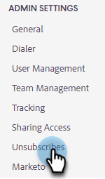

# 自动附加取消订阅信息设置 {#auto-append-unsubscribe-message-setting}

确保发送的每个Sales Insight Actions电子邮件都包含取消订阅消息，以便收件人可以轻松选择退出通信。 在启用附加取消订阅消息后，您的团队从Marketo Sales发送的所有通信都将包含取消订阅消息，包括从Web应用程序和Salesforce发送的电子邮件。

>[!NOTE]
>
>如果您在电子邮件模板中使用`{{team_unsubscribe}}`动态字段并且启用了取消订阅消息附加设置，则团队取消订阅动态字段将填充您的取消订阅消息&#x200B;_，而不是_&#x200B;附加您的取消订阅消息。

## 启用/禁用取消订阅附加 {#enable-disable-unsubscribe-append}

1. 单击齿轮图标并选择&#x200B;**设置**。

   

1. 在“管理员设置”下，单击&#x200B;**取消订阅**。

   

1. 在“消息传递”选项卡的“附加取消订阅消息”下，将滑块移动到所需的状态。

   

>[!TIP]
>
>如果禁用附加取消订阅消息设置，我们建议向模板添加取消订阅页脚，以确保您的通信具有选择退出选项。 您可通过向每个模板添加自己的自定义消息或使用`{{team_unsubscribe}}` [动态字段](/help/marketo/product-docs/marketo-sales-insight/actions/templates/dynamic-fields.md){target="_blank"}来执行此操作。
