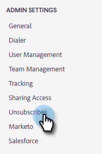
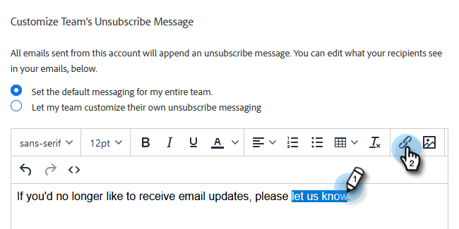

# 自定义取消订阅链接消息 {#customize-unsubscribe-link-message}

我们始终允许团队自定义其取消订阅链接消息传送，但管理员可以选择为整个团队设置取消订阅链接消息传送，以确保消息传送一致。

>[!NOTE]
>
>您无法与Marketo Sales使用第三方取消订阅链接，因为此信息不会被捕获回我们的数据库中。

1. 单击齿轮图标，然后选择 **设置**.

   

1. 在“管理员设置”下，单击 **取消订阅**.

   

1. 确定此消息是否将是整个团队的默认消息，或者是否希望让团队创建自己的消息（在本例中，我们选择默认消息）。 在文本框中写出您的自定义消息。

   

1. 突出显示您希望用户单击以进入取消订阅页面的文本，然后单击链接图标。

   

   >[!NOTE]
   >
   >您输入的URL无关紧要。 发送电子邮件后，第一个（或仅限）超链接将自动链接到默认的取消订阅页面。

1. 输入URL，确定您希望在当前窗口还是新窗口中打开该链接，然后单击 **保存**.

   

1. 单击 **保存** 来保存更改。

   
