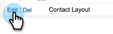

# 正在与Salesforce同步取消订阅 {#syncing-unsubscribes-with-salesforce}

如果要在Salesforce中将取消订阅与选择退出字段同步，则可以使用Salesforce取消订阅同步。

## 取消订阅同步到Salesforce的要求 {#requirements-for-unsubscribes-to-sync-to-salesforce}

* 必须启用取消订阅同步（用于夜间同步）
* 必须在Salesforce中安装“选择退出”字段
* Marketo Sales中的人员记录必须具有Salesforce ID

**推送取消订阅**

在Marketo Sales中收集取消订阅后，我们会将其实时推送到Salesforce，并更新您选择与之同步的任何一个选择退出字段。 如果您禁用了Salesforce同步，我们仍会将取消订阅推送到电子邮件选择退出。

**取消订阅同步**

启用取消订阅同步后（下面的步骤3），您将启用夜间同步。 同步在PST晚上8:00左右每天执行一次。 它会将Marketo Sales中的所有取消订阅与Salesforce中的Opt Out字段双向同步。

>[!NOTE]
>
>取消订阅与Salesforce同步将同步取消订阅，但不会同步重新订阅。 如果要从Marketo Sales和Salesforce中删除取消订阅，请在Salesforce中取消选中unsubscribe ，并在Marketo Sales中删除取消订阅。

## 配置取消订阅同步到Salesforce {#configure-unsubscribe-sync-to-salesforce}

用户可以决定是希望与Marketo也可以同步的标准电子邮件选择退出字段同步其取消订阅，还是可以与Marketo销售人员选择退出字段同步，以便区分销售人员取消订阅和营销人员取消订阅。

1. 单击齿轮图标并选择 **设置**.

   

1. 在管理设置下，选择 **取消订阅**.

   

1. 单击 **集成** 选项卡。 在“同步到Salesforce”下，启用夜间同步。

   

1. 选择要同步到的字段。

   

   | 字段 | 描述 |
   |---|---|
   | **同步到Salesforce选择退出字段** | 默认情况下处于选中状态，只会更新Salesforce选择退出字段。 |
   | **同步到“Marketo销售人员选择退出”字段** | 如果要将销售和营销取消订阅分开，请选择此选项以更新其他 [Marketo Sales Opt Out字段。](#msoo) |

## 在页面布局中安装选择退出字段 {#installing-the-opt-out-field-in-the-page-layout}

**电子邮件选择退出**

电子邮件选择退出是Salesforce中的一个标准字段，可从Salesforce安装。 您必须是Salesforce管理员才能安装此软件。

1. 转到 [Salesforce.com](https://salesforce.com) 并登录。

   

1. 单击您的用户名并选择 **设置**.

   

1. 在快速查找框中，搜索Contact或Lead。 在此方案中，我们会将字段安装到联系人页面布局，但您希望为两个人员记录都安装。

   

1. 选择 **页面布局**.

   

1. 选择 **编辑** 在页面布局旁边，您需要添加字段。

   

1. 选择 **字段**.

   

1. 将“电子邮件选择退出”拖放到页面布局中。

   

1. 单击 **保存**.

   

## Marketo销售人员选择退出 {#marketo-sales-opt-out}

Marketo销售人员选择退出字段是一个自定义字段，可供已安装Marketo销售人员分析包的用户使用 [从AppExchange](/help/marketo/product-docs/marketo-sales-insight/msi-for-salesforce/installation/install-marketo-sales-insight-package-in-salesforce-appexchange.md){target="_blank"}.

成功将Marketo Sales Insight程序包从AppExchange安装到Salesforce中后，您将看到可供您使用的Marketo Sales选择退出字段。
