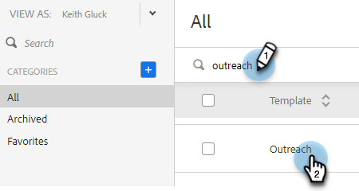
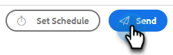

# 交易型销售电子邮件模板 {#transactional-sales-email-templates}

如果您的团队发送事务性或非商业性电子邮件，您可以将电子邮件模板标记为非商业性，这样它就可以绕过取消订阅。

## 注意事项 {#things-to-note}

* 非商业电子邮件将绕过销售取消订阅和[Marketo Engage取消订阅检查](/help/marketo/product-docs/marketo-sales-insight/actions/email/unsubscribes/marketo-unsubscribe-check.md){target="_blank"}，但不会绕过[阻止的域](/help/marketo/product-docs/marketo-sales-insight/actions/admin/blocked-domains.md){target="_blank"}。

* 即使启用了[附加取消订阅消息管理员设置](/help/marketo/product-docs/marketo-sales-insight/actions/email/unsubscribes/auto-append-unsubscribe-message-setting.md){target="_blank"}，取消订阅消息也不会自动附加到非商业电子邮件。 但是，`{{team_unsubscribe}}` [动态字段](/help/marketo/product-docs/marketo-sales-insight/actions/templates/dynamic-fields.md){target="_blank"}仍将填充您的团队取消订阅消息。

## 配置电子邮件模板用于非商业用途 {#configure-an-email-template-for-non-commercial-use}

1. 在标题中，单击&#x200B;**模板**。

   

1. 查找并选择要更新的模板。

   

1. 在“模板设置”下启用非商业电子邮件切换。

   

## 发送非商业电子邮件 {#send-a-non-commercial-email}

>[!NOTE]
>
>选择取消订阅的人员时，他们将会突出显示为橙色。

1. 在标题中，单击&#x200B;**撰写**。 查找并选择所需的非商业模板。

   

1. 用户将看到一个横幅，显示他们已选择非商业电子邮件模板。

   

1. 单击&#x200B;**发送**。

   

即使此人已取消订阅，仍会发送电子邮件。
