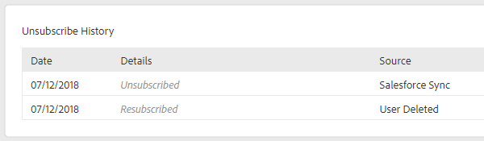

# 取消订阅概述 {#unsubscribe-overview}

组织遵守电子邮件隐私法律越来越重要。 为了帮助解决此问题，我们对取消订阅体验进行了一些增强。

* 从[!DNL Marketo Sales]和[!DNL Salesforce]发送的所有电子邮件上都会放置取消订阅链接（这不适用于从[!DNL Outlook]或Gmail发送的自定义电子邮件）
* 管理员可以编辑其整个团队的取消订阅消息
* 取消订阅信息存储在PDV中
* 取消订阅可以手动完成：点击的链接、[!DNL Salesforce]同步和退回
* 新的取消订阅链接登陆页面

## 取消订阅链接登陆页面 {#unsubscribe-link-landing-page}

当某人单击您的取消订阅链接时，将会转到取消订阅登陆页面，其中用户可以选择要取消订阅的内容及其原因。

此信息将保存到人员详细信息视图以供稍后查看。

## 取消订阅组 {#unsubscribe-group}

在一个位置查看和管理所有已取消订阅的人员。

使用搜索栏查找任何已取消订阅的人员。

如果您是管理员，则可以转到取消订阅组以按[!UICONTROL Account Unsubscribes]进行筛选，并查看已在人员数据库中收集的所有取消订阅。

## 取消订阅历史记录卡 {#unsubscribe-history-card}

[!UICONTROL Unsubscribe History]卡可帮助管理员和用户获取有关其联系人的取消订阅历史记录的上下文信息。 通过转到[!UICONTROL People]选项卡并选择人员来导航到此处。 它位于“人员详细信息”视图中的[!UICONTROL About]选项卡底部。

>[!NOTE]
>
>仅当此人在某个时间点重新订阅[!UICONTROL Unsubscribe History]了&#x200B;_时，才会有_&#x200B;信息卡。

<table> 
 <colgroup> 
  <col> 
  <col> 
 </colgroup> 
 <tbody> 
  <tr> 
   <td><strong>[!UICONTROL Date]</strong></td> 
   <td>
显示取消订阅/重新订阅的日期。
</td> 
  </tr> 
  <tr> 
   <td><strong>[!UICONTROL Details]</strong></td> 
   <td>
重新订阅： [!DNL Sales Connect]管理员手动从联系人记录中删除了取消订阅。 它也可能显示与联系人取消订阅原因相关的一些详细信息。

取消订阅：联系人已取消订阅。
</td> 
  </tr> 
  <tr> 
   <td><strong>[!UICONTROL Source]</strong></td> 
   <td>
[!DNL Salesforce] 同步：已通过[!DNL Salesforce]的同步捕获取消订阅。

手动：用户单击取消订阅按钮以选择退出。

已单击链接：电子邮件收件人已单击取消订阅链接。

“管理员姓名”：在操作重新订阅联系人时，将显示管理员姓名。 这使用户知道谁删除了取消订阅。
</td> 
  </tr> 
 </tbody> 
</table>

>[!MORELIKETHIS]
>
>[自定义取消订阅链接消息](/help/marketo/product-docs/marketo-sales-insight/actions/email/unsubscribes/customize-unsubscribe-link-message.md)
