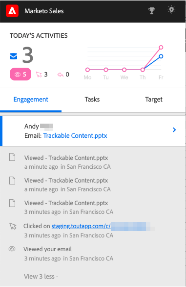

# 向电子邮件添加附件或可跟踪内容 {#add-an-attachment-or-trackable-content-to-your-email}

通过Marketo Sales发送电子邮件时，您可以选择将文件添加为附件，也可以将文件设为可下载（和可跟踪）链接。

>[!NOTE]
>
>通常，任何超过20 MB的文件都将太大，无法传送。 您可以通过电子邮件发送的附件大小因您使用的电子邮件投放渠道而异。

## 添加附件 {#add-an-attachment}

1. 创建您的电子邮件草稿(可通过多种方法执行此操作，在本例中，我们将选择 **撰写** （在标题中）。

   

1. 填充“收件人”字段并输入主题。

   

1. 单击附件图标。

   

1. 选择要附加的文件，然后单击 **插入**.

   

   >[!NOTE]
   >
   >如果您需要上传文件，请单击 **上传内容** 按钮来打开窗口。

   附件显示在电子邮件的底部。

   

## 添加可跟踪内容 {#add-trackable-content}

1. 创建电子邮件草稿（可通过多种方法执行此操作，在本例中，我们将选择“撰写”窗口）。

   

1. 填充“收件人”字段并输入主题。

   

1. 单击电子邮件中您希望可跟踪内容显示的位置，然后单击附件图标。

   

1. 选择要添加的内容，单击 **内容已跟踪** 滑块，然后单击 **插入**.

   

   >[!NOTE]
   >
   >如果您需要上传文件，请单击 **上传内容** 按钮来打开窗口。

   该内容将作为链接显示在您的电子邮件中。 收件人可以单击链接以下载内容。

   

   >[!NOTE]
   >
   >当用户查看其跟踪的内容时，将会在实时信息源中通知用户。 用户还可以在Analytics页面的“内容”部分中看到性能最高的内容。

## 可跟踪的内容更新 {#trackable-content-updates}

**可跟踪的内容查看器**

当潜在客户单击电子邮件中的可跟踪内容时，将打开内容查看器。

在内容查看器内，潜在客户可以执行以下操作。

* 下载文档

* 翻阅文档

* 查看发件人的联系信息

**实时信息源中的可跟踪内容事件**

当潜在客户单击我们文档的链接时，您将看到一个单击事件。 您可以单击该链接以查看内容。 只要您在浏览器中登录到您的Actions帐户，我们就不会将这些点击计为事件。

每次潜在客户进入文档上的另一个页面时，您将在实时信息源中收到一个已查看事件，该事件显示文档的名称。
