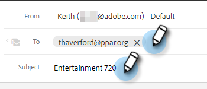

# 向电子邮件中添加重点内容 {#adding-highspot-content-to-your-email}

如果您是Highspot客户，则可以轻松地将Highspot内容插入您的Markto销售电子邮件中。

1. 创建电子邮件草稿(有多种方法可执行此操作，在本例中，我们选择了 **撰写** )。

   

1. 填写“收件人”字段并输入主题。

   

1. 写信。 单击电子邮件中要插入高点内容的位置。 单击箭头下拉列表（图像图标旁边），然后选择 **高光点**.

   

1. 登录到您的Highspot帐户。

   

1. 选择所需的内容，然后单击 **添加内容** 按钮。

   

   >[!TIP]
   >
   >如果您没有快速看到所需内容，请使用顶部的搜索栏。

   内容会在您的电子邮件中显示为链接。 收件人可以单击链接以查看/下载该链接。

   
