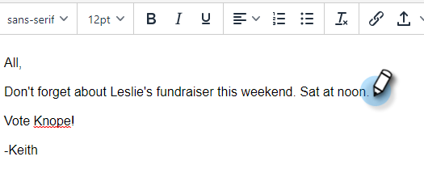

# 使用选择并发送功能撰写批量电子邮件 {#composing-bulk-emails-with-select-and-send}

以下是如何使用[!UICONTROL Select]和[!UICONTROL Send]选项发送/编辑电子邮件。

## 发送电子邮件 {#sending-emails}

1. 导航到&#x200B;**[!UICONTROL People page]**。

   

1. 选择要通过电子邮件发送的人员。

   

   >[!NOTE]
   >
   >使用“选择并发送”时，最多可以选择200人。

1. 单击&#x200B;**[!UICONTROL Email Selected]**&#x200B;按钮。

   

1. 输入主题行，选择模板（或从头开始撰写电子邮件），然后发送/[计划](/help/marketo/product-docs/marketo-sales-connect/email/using-the-compose-window/scheduling-an-email.md)电子邮件。

   

   >[!NOTE]
   >
   >如果您选择了模板并希望检查所有动态字段在发送前是否都已正确填充，请单击&#x200B;**[!UICONTROL Preview Dynamic Fields]**。 确保选中批量侧边栏中的所有收件人以预览所有电子邮件。 如果您选择一封电子邮件并单击&#x200B;**[!UICONTROL Preview Dynamic Fields]**，则只会预览该电子邮件。

## 编辑电子邮件 {#editing-emails}

**批量编辑**

1. 按照上面[发送电子邮件](#sending-emails)部分中的步骤1-3操作。

   >[!NOTE]
   >
   >默认情况下，将选择所有收件人。 如果单击某个人并想要重新选择所有人，请单击&#x200B;**[!UICONTROL All Recipients]**。 提醒一下，必须选择所有收件人才能进行批量编辑。

1. 在编辑器中做出更改。 您可以创建新电子邮件或编辑模板（在此示例中，我们正在创建新电子邮件）。

   

   >[!NOTE]
   >
   >您可以单击某个特定的电子邮件收件人，以查看传播到该电子邮件的更改。

1. 单击&#x200B;**[!UICONTROL Send]**（或[[!UICONTROL Schedule]](/help/marketo/product-docs/marketo-sales-connect/email/using-the-compose-window/scheduling-an-email.md)）向所有收件人发送您进行的批量电子邮件更新。

   

**编辑每封电子邮件**

在自定义每封电子邮件之前完成批量更新，因为进行批量更新会覆盖批量撰写侧边栏中每封电子邮件的更改。

1. 按照[发送电子邮件部分](#sending-emails)中的步骤1-4操作。

   >[!NOTE]
   >
   >默认情况下，将选择所有收件人。 如果单击某个人并想要重新选择所有人，请单击&#x200B;**[!UICONTROL All Recipients]**。 提醒一下，必须选择所有收件人才能进行批量编辑。

1. 选择单个收件人。

   

1. 在编辑器中做出更改。

   

   >[!NOTE]
   >
   >在这里，您可以在批量侧边栏中对单个电子邮件进行编辑，而无需更新其余电子邮件。

   >[!TIP]
   >
   >您可以单击其他收件人，以查看未显示您对之前选定的收件人所做的更改。

1. 单击&#x200B;**[!UICONTROL Send]**（或[[!UICONTROL Schedule]](/help/marketo/product-docs/marketo-sales-connect/email/using-the-compose-window/scheduling-an-email.md)）向所有收件人发送您进行的批量电子邮件更新。

   

   >[!MORELIKETHIS]
   >
   >* [批量发送电子邮件选项](/help/marketo/product-docs/marketo-sales-insight/actions/email/using-the-compose-window/bulk-emailing-options.md)
   >* [在撰写窗口中使用模板](/help/marketo/product-docs/marketo-sales-connect/email/using-the-compose-window/using-a-template-in-the-compose-window.md)
   >* [动态字段](/help/marketo/product-docs/marketo-sales-connect/templates/dynamic-fields/how-to-insert-dynamic-fields.md)
