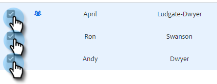

# 使用选择并发送来合成批量电子邮件 {#composing-bulk-emails-with-select-and-send}

以下是如何使用选择并发送选项发送/编辑电子邮件。

## 发送电子邮件 {#sending-emails}

1. 导航到人员页面。

   

1. 选择要发送电子邮件的人员。

   

   >[!NOTE]
   >
   >使用“选择并发送”时，最多可以选择200人。

1. 单击 **已选择电子邮件** 按钮。

   

1. 输入主题行，选择模板（或从头开始撰写电子邮件），然后发送/发送[计划](/help/marketo/product-docs/marketo-sales-connect/email/using-the-compose-window/scheduling-an-email.md) 电子邮件。

   

   >[!NOTE]
   >
   >如果您选择了模板，并想要检查所有动态字段在发送之前是否正确填充，请单击 **预览动态字段**. 确保已选择批量侧栏中的所有收件人以预览所有电子邮件。 如果您选择一封电子邮件并单击 **预览动态字段**，则只会预览该电子邮件。

## 编辑电子邮件 {#editing-emails}

**批量编辑**

1. 按照 [发送电子邮件部分](#sending-emails) 上。

   >[!NOTE]
   >
   >默认情况下，将选择所有收件人。 如果单击某个人并想要重新选择每个人，请单击 **所有收件人**. 请注意，必须选择所有收件人才能进行批量编辑。

1. 在编辑器中进行更改。 您可以创建新电子邮件或编辑模板（在本例中，我们将创建新电子邮件）。

   

   >[!NOTE]
   >
   >您可以单击特定的电子邮件收件人，以查看传播到该电子邮件的更改。

1. 单击 **发送** (或 [计划](/help/marketo/product-docs/marketo-sales-connect/email/using-the-compose-window/scheduling-an-email.md))，以通过您进行的批量电子邮件更新发送给所有收件人。

   

**编辑每个电子邮件**

在自定义每封电子邮件之前完成批量更新，因为进行批量更新会覆盖批量撰写侧栏中对每封电子邮件所做的更改。

1. 按照 [发送电子邮件部分](#sending-emails).

   >[!NOTE]
   >
   >默认情况下，将选择所有收件人。 如果单击某个人并想要重新选择每个人，请单击 **所有收件人**. 请注意，必须选择所有收件人才能进行批量编辑。

1. 选择单个收件人。

   

1. 在编辑器中进行更改。

   

   >[!NOTE]
   >
   >您可以在此处批量侧栏中对单个电子邮件进行编辑，而无需更新其余的电子邮件。

   >[!TIP]
   >
   >您可以单击其他收件人，以查看您对先前选定的收件人所做的更改是否未显示。

1. 单击 **发送** (或 [计划](/help/marketo/product-docs/marketo-sales-connect/email/using-the-compose-window/scheduling-an-email.md))，以通过您进行的批量电子邮件更新发送给所有收件人。

   

   >[!MORELIKETHIS]
   >
   >* [批量电子邮件发送选项](/help/marketo/product-docs/marketo-sales-insight/actions/email/using-the-compose-window/bulk-emailing-options.md)
   >* [在撰写窗口中使用模板](/help/marketo/product-docs/marketo-sales-connect/email/using-the-compose-window/using-a-template-in-the-compose-window.md)
   >* [动态字段](/help/marketo/product-docs/marketo-sales-connect/templates/dynamic-fields/how-to-insert-dynamic-fields.md)

