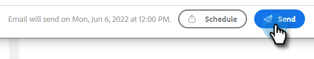

# 计划电子邮件 {#scheduling-an-email}

按照这些简单的步骤安排电子邮件发送。

>[!NOTE]
>
>要更新默认时区，请转到“设置”页面。

1. 创建电子邮件草稿（在本例中，我们选择了多种方法来执行此操作） **撰写** )。

   

1. 完成电子邮件的撰写后，单击 **计划** 在右下方

   

1. 单击日期以打开日期选取器并选择日期。

   

1. 输入您希望电子邮件发出的时间。 选择所需的时区并单击 **保存**. 完成后关闭调度程序。

   

1. 现在，已选择您的计划日期/时间，单击 **发送** 以计划电子邮件。

   

   >[!NOTE]
   >
   >可以在命令中心的“计划文件夹”部分查看/编辑计划电子邮件。

   >[!MORELIKETHIS]
   >
   >[命令中心概述](/help/marketo/product-docs/marketo-sales-insight/actions/email/command-center/command-center-overview.md)
