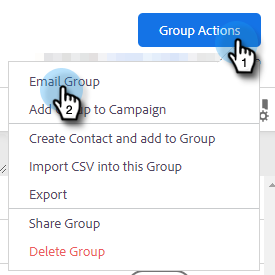
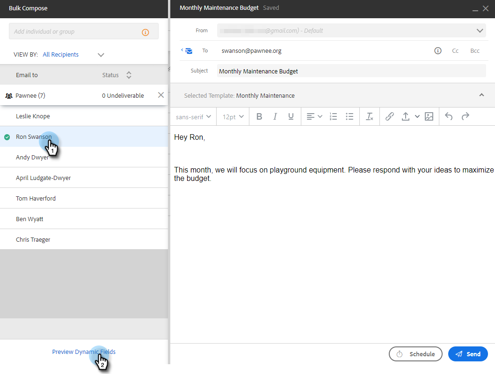

# 通过群组电子邮件发送电子邮件 {#sending-emails-via-group-email}

以下是如何使用群组电子邮件选项发送/编辑电子邮件。

## 发送群组电子邮件 {#sending-a-group-email}

1. 单击 **人员** 选项卡。

   

1. 选择要发送电子邮件的群组。

   

1. 单击Group Actions按钮，然后选择 **电子邮件群组**.

   

1. 填写您的电子邮件（或选择模板）并发送（或计划）它。

   

## 编辑群组电子邮件 {#editing-a-group-email}

1. 使用创建群组电子邮件 [上述步骤1-3](#sending-a-group-email).

1. [选择模板](/help/marketo/product-docs/marketo-sales-insight/actions/email/using-the-compose-window/using-a-template-in-the-compose-window.md)，或填写您的电子邮件。

   

1. 电子邮件完成后，您现在可以预览列表中的每个电子邮件，以查看动态字段是否正确填充。

   

1. 选择所需的收件人并单击 **预览动态字段**. 查看右侧的预览。

   

   >[!NOTE]
   >
   >在发出群组电子邮件时，您可以对电子邮件/模板进行批量编辑，但您无法对列表中的特定收件人进行唯一编辑。

>[!MORELIKETHIS]
>
>* [批量发送选项](/help/marketo/product-docs/marketo-sales-insight/actions/email/using-the-compose-window/bulk-emailing-options.md)
>* [在撰写窗口中使用模板](/help/marketo/product-docs/marketo-sales-insight/actions/email/using-the-compose-window/using-a-template-in-the-compose-window.md)

