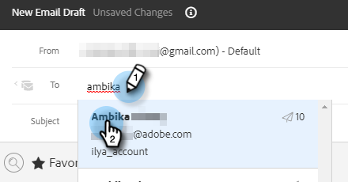

# 在撰写窗口中使用模板 {#using-a-template-in-the-compose-window}

## 查找和使用模板 {#finding-and-using-templates}

1. 创建您的电子邮件草稿(可通过多种方法执行此操作，在本例中，我们将选择 **撰写** （在标题中）。

   

1. 填充“收件人”字段。

   

1. 单击模板部分中的搜索图标以打开模板搜索字段。

   

1. 选择要搜索的类别（或选择全部以搜索所有类别）。

   

1. 按电子邮件模板名称、主题行或正文搜索。 单击所需的模板以将其选定。

   

   >[!NOTE]
   >
   >选择另一个模板将替换编辑器中当前的所有信息。 如果进行了任何更改，请确保在选择其他模板之前复制这些更改。

## 在撰写窗口中固定模板类别 {#pinning-template-categories-in-the-compose-window}

收藏 **最多五个** 特定模板类别，以便快速访问您最常用的模板。

1. 创建您的电子邮件草稿(可通过多种方法执行此操作，在本例中，我们将选择 **撰写** （在标题中）。

   

1. 单击 **+** 图标（位于收藏夹旁）。

   

1. 单击 **固定类别** 下拉列表并选择所需的类别。

   

   >[!TIP]
   >
   >我们建议固定“全部”类别，以便让您能够快速搜索整个模板库，因为您可能通常需要搜索所有模板来找到要查找的内容。 如果您选择了固定类别并单击搜索图标，则搜索将默认使用选定固定类别中的搜索。

1. 单击 **保存更改** 完成后（可选：重复步骤3以添加更多）。

   

   >[!TIP]
   >
   >在保存更改之前，只需拖放一下即可重新排列固定类别。

   

   >[!NOTE]
   >
   >**收藏夹** 默认存在。 它包含最喜爱的电子邮件模板，而不是类别。

   您选择的类别现已固定。
