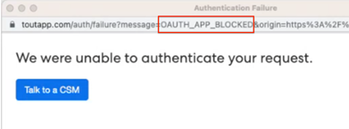

# 如何在连接到[!DNL Salesforce]时修复“我们无法验证您的请求” {#how-do-i-fix-we-were-unable-to-authenticate-your-request-when-connecting-to-salesforce}

如果您尝试将Marketo Sales实例连接到Salesforce并看到“我们无法验证您的请求”错误，则它可能与您的Salesforce实例的配置有关。

有两种类型的错误可能会产生此失败的身份验证页面。

* 登录错误受限域
* 已阻止Oauth应用程序

您可以通过检查URL来识别您获得的类型。

## 解决登录错误受限域 {#resolve-login-error-restricted-domain}

此错误通常表示您有一个自定义域，我们无法路由到该域。 要解决此错误，请尝试先登录到要连接的Salesforce实例。 然后，完成连接到Salesforce的步骤。

如果您尝试连接的实例是Salesforce沙盒域并且收到错误，您将需要执行其他步骤以将实例更新为可与Salesforce沙盒兼容的实例。 [了解详情](/help/marketo/product-docs/marketo-sales-insight/actions/crm/salesforce-integration/set-up-a-sales-insight-actions-sandbox.md){target="_blank"}。

## 已阻止解析Oauth应用程序 {#resolve-oauth-app-blocked}

如果您在URL中收到错误消息“我们无法验证您的请求”，并显示被阻止的Oauth应用程序错误类型（或其他类型），则您对Salesforce API的访问可能会受到限制。 请与您的Salesforce管理员确认，以确保已实施以下措施。

### 在用户权限中启用API {#enable-api-in-user-permissions}

1. 让Salesforce管理员登录到Salesforce。
1. 选择&#x200B;**设置**。
1. 选择&#x200B;**管理用户**。
1. 选择&#x200B;**配置文件**。
1. 查找ToutApp用户所属的配置文件，然后单击&#x200B;**编辑**。
1. 向下滚动到&#x200B;**管理权限**&#x200B;并确保选中&#x200B;**已启用API**。

### 检查Salesforce是否阻止销售Insight操作进行连接 {#check-if-salesforce-is-blocking-sales-insight-actions-from-connecting}

1. 让Salesforce管理员登录到Salesforce。
1. 选择&#x200B;**设置**。
1. 选择&#x200B;**管理应用程序**。
1. 选择&#x200B;**连接的应用程序OAuth使用情况**。
1. 确保Sales Insight操作旁边显示“阻止”。 如果看到“取消阻止”，请单击按钮以取消阻止Insight销售人员操作访问Salesforce。
