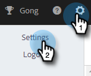

# 添加或更新您的电子邮件签名 {#add-or-update-your-email-signature}

我们希望通过Marketo Sales的电子邮件从您自己的电子邮件客户端发送时获得流畅的体验。 一个很好的方法是添加您的电子邮件签名。

1. 单击齿轮图标并选择&#x200B;**[!UICONTROL Settings]**。

   

1. 在[!UICONTROL My Account]下，选择&#x200B;**[!UICONTROL Email Settings]**。

   

1. 在&#x200B;**[!UICONTROL Address and Signature]**&#x200B;选项卡中，选择要为其创建签名的电子邮件标识。

   

1. 在[!UICONTROL Signature]信息卡中，单击&#x200B;**[!UICONTROL Edit]**。

   

1. 输入所需的文本（或图像）并单击&#x200B;**[!UICONTROL Save]**。

   

   >[!TIP]
   >
   >确保在撰写屏幕中的签名与电子邮件客户端中列出的签名类似。
